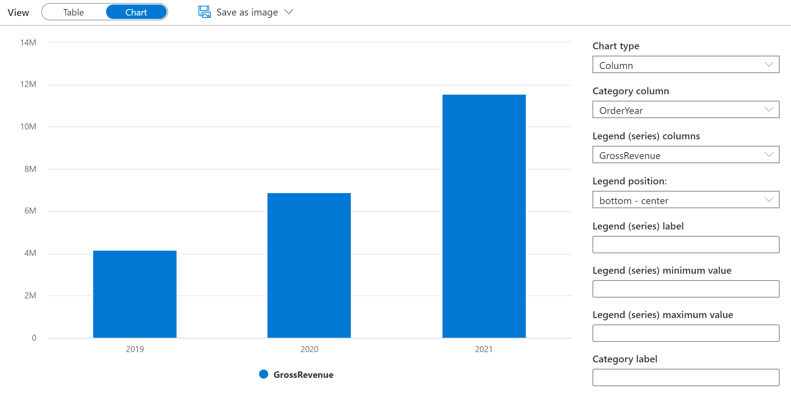

---
lab:
  title: Consultar arquivos usando um pool de SQL sem servidor
  ilt-use: Lab
---

# Consultar arquivos usando um pool de SQL sem servidor

SQL é provavelmente a linguagem mais usada para trabalhar com dados no mundo. A maioria dos analistas de dados é proficiente no uso de consultas SQL para recuperar, filtrar e agregar dados – mais comumente em bancos de dados relacionais. À medida que as organizações aproveitam cada vez mais o armazenamento escalonável de arquivos para criar data lakes, o SQL geralmente ainda é a opção preferida para consultar os dados. O Azure Synapse Analytics fornece pools SQL sem servidor que permitem separar o mecanismo de consulta SQL do armazenamento de dados e executar consultas em arquivos de dados em formatos de arquivo comuns, como texto delimitado e Parquet.

Este laboratório levará aproximadamente **40** minutos para ser concluído.

## Antes de começar

É necessário ter uma [assinatura do Azure](https://azure.microsoft.com/free) com acesso de nível administrativo.

## Provisionar um workspace do Azure Synapse Analytics

Você precisará de um espaço de trabalho do Azure Synapse Analytics com acesso ao armazenamento de data lake. Você pode usar o pool do SQL interno sem servidor para consultar arquivos no data lake.

Neste exercício, você usará uma combinação de um script do PowerShell e um modelo ARM para provisionar um espaço de trabalho do Azure Synapse Analytics.

1. Entre no [portal do Azure](https://portal.azure.com) em `https://portal.azure.com`.
2. Use o botão **[\>_]** à direita da barra de pesquisa na parte superior da página para criar um Cloud Shell no portal do Azure, selecionando um ambiente ***PowerShell*** e criando armazenamento caso solicitado. O Cloud Shell fornece uma interface de linha de comando em um painel na parte inferior do portal do Azure, conforme mostrado aqui:

    

    > **Observação**: se você tiver criado anteriormente um cloud shell que usa um ambiente *Bash*, use o menu suspenso no canto superior esquerdo do painel do cloud shell para alterá-lo para ***PowerShell***.

3. Observe que você pode redimensionar o Cloud Shell arrastando a barra do separador na parte superior do painel ou usando os ícones **&#8212;** , **&#9723;** e **X** no canto superior direito do painel para minimizar, maximizar e fechar o painel. Para obter mais informações de como usar o Azure Cloud Shell, confira a [documentação do Azure Cloud Shell](https://docs.microsoft.com/azure/cloud-shell/overview).

4. No painel do PowerShell, digite o seguinte comando para clonar este repositório:

    ```
    rm -r dp203 -f
    git clone https://github.com/MicrosoftLearning/dp-203-azure-data-engineer dp203
    ```

5. Depois que o repositório tiver sido clonado, digite os seguintes comandos para alterar a pasta para a neste laboratório e executar o **setup.ps1** contido nela:

    ```
    cd dp203/Allfiles/labs/02
    ./setup.ps1
    ```

6. Se solicitado, escolha qual assinatura você deseja usar (isso só acontecerá se você tiver acesso a várias assinaturas do Azure).
7. Quando solicitado, insira uma senha adequada a ser definida para seu pool de SQL do Azure Synapse.

    > **Observação**: Memorize a senha.

8. Aguarde a conclusão do script – isso normalmente leva cerca de 10 minutos, mas em alguns casos pode demorar mais. Enquanto espera, revise o artigo [Pool de SQL sem servidor no Azure Synapse Analytics](https://docs.microsoft.com/azure/synapse-analytics/sql/on-demand-workspace-overview) na documentação do Azure Synapse Analytics.

## Consultar dados em arquivos

O script provisiona um espaço de trabalho do Azure Synapse Analytics e uma conta de Armazenamento do Azure para hospedar o data lake e, em seguida, carrega alguns arquivos de dados no data lake.

### Exibir arquivos no data lake

1. Depois que o script for concluído, no portal do Azure, vá para o Azure Storage **dp203-*xxxxxxx*** que ele criou e selecione seu espaço de trabalho Synapse.
2. Na página **Visão geral** do seu workspace do Synapse, no cartão **Abrir o Synapse Studio**, selecione **Abrir** para abrir o Synapse Studio em uma nova guia do navegador, fazendo login se solicitado.
3. No lado esquerdo do Synapse Studio, use o ícone **&rsaquo;&rsaquo;** para expandir o menu – o que revela as diferentes páginas do Synapse Studio usadas para gerenciar recursos e executar tarefas de análise de dados.
4. Na página **Dados**, exiba a guia **Vinculado** e verifique se seu workspace inclui um link para sua conta de armazenamento do Azure Data Lake Storage Gen2, que deve ter um nome semelhante à **synapse*xxxxxxx* (Primary - datalake*xxxxxxx*)**.
5. Expanda sua conta de armazenamento e verifique se ela contém um contêiner do sistema de arquivos chamado **arquivos**.
6. Selecione o contêiner de **arquivos** e observe que ele contém uma pasta chamada **vendas**. Esta pasta contém os arquivos de dados que você vai consultar.
7. Abra a pasta de **vendas** e a pasta **csv** que ela contém e observe que essa pasta contém arquivos .csv para três anos de dados de vendas.
8. Clique com o botão direito do mouse em qualquer um dos arquivos e selecione **Visualizar** para ver os dados que ele contém. Observe que os arquivos não contêm uma linha de cabeçalho, portanto, você pode desmarcar a opção para exibir cabeçalhos de coluna.
9. Feche a versão prévia e use o botão **&#8593;** para navegar de volta para a pasta **vendas**.
10. Na pasta **vendas**, abra a pasta **json** e observe que ela contém alguns exemplos de pedidos de vendas em arquivos .json. Visualize qualquer um desses arquivos para ver o formato JSON usado para uma ordem do cliente.
11. Feche a versão prévia e use o botão **&#8593;** para navegar de volta para a pasta **vendas**.
12. Na pasta **vendas**, abra a pasta **parquet** e observe que ela contém uma subpasta para cada ano (2019-2021), em cada uma das quais um arquivo denominado **orders.snappy.parquet** contém os dados do pedido daquele ano. 
13. Retorne à pasta **vendas** para ver as pastas **csv****, json** e **parquet**.

### Usar o SQL para consultar arquivos CSV

1. Selecione a pasta **csv** e, na lista **Novo script SQL** na barra de ferramentas, selecione **Selecionar as 100 PRIMEIRAS LINHAS**.
2. Na lista **Tipo de arquivo**, selecione **Formato** de texto e aplique as configurações para abrir um novo script SQL que consulta os dados na pasta.
3. No painel **Propriedades** do **Script SQL 1** criado, altere o nome para **Consulta CSV de vendas** e altere as configurações de resultado para mostrar **Todas as linhas**. Em seguida, na barra de ferramentas, selecione **Publicar** para salvar o script e use o botão **Propriedades** (que é semelhante a **&#128463;.**) na extremidade direita da barra de ferramentas para ocultar o painel **Propriedades**.
4. Examine o código de SQL que foi gerado e deve ser semelhante a este:

    ```SQL
    -- This is auto-generated code
    SELECT
        TOP 100 *
    FROM
        OPENROWSET(
            BULK 'https://datalakexxxxxxx.dfs.core.windows.net/files/sales/csv/',
            FORMAT = 'CSV',
            PARSER_VERSION='2.0'
        ) AS [result]
    ```

    Esse código usa o OPENROWSET para ler dados dos arquivos CSV na pasta de vendas e recupera as primeiras 100 linhas de dados.

5. Na lista **Conectar-se a**, verifique se **Interno** está selecionado — isso representa o Pool de SQL interno que foi criado com o seu workspace.
6. Na barra de ferramentas, use o botão **&#9655; Executar** para executar o código SQL e examine os resultados, que devem ser semelhantes a este:

    | C1 | C2 | C3 | C4 | C5 | C6 | C7 | C8 | C9 |
    | -- | -- | -- | -- | -- | -- | -- | -- | -- |
    | SO45347 | 1 | 01/01/2020 | Clarence Raji | clarence35@adventure-works.com |Road-650 Black, 52 | 1 | 699.0982 | 55.9279 |
    | ... | ... | ... | ... | ... | ... | ... | ... | ... |

7. Observe que os resultados consistem em colunas chamadas C1, C2 e assim por diante. Neste exemplo, os arquivos CSV não incluem os cabeçalhos de coluna. Embora seja possível trabalhar com os dados usando os nomes de coluna genéricos que foram atribuídos ou por posição ordinal, será mais fácil entender os dados se você definir um esquema tabular. Para fazer isso, adicione uma cláusula WITH à função OPENROWSET, conforme mostrado aqui (substituindo *datalakexxxxxxx* pelo nome da sua conta de armazenamento do data lake) e execute novamente a consulta:

    ```SQL
    SELECT
        TOP 100 *
    FROM
        OPENROWSET(
            BULK 'https://datalakexxxxxxx.dfs.core.windows.net/files/sales/csv/',
            FORMAT = 'CSV',
            PARSER_VERSION='2.0'
        )
        WITH (
            SalesOrderNumber VARCHAR(10) COLLATE Latin1_General_100_BIN2_UTF8,
            SalesOrderLineNumber INT,
            OrderDate DATE,
            CustomerName VARCHAR(25) COLLATE Latin1_General_100_BIN2_UTF8,
            EmailAddress VARCHAR(50) COLLATE Latin1_General_100_BIN2_UTF8,
            Item VARCHAR(30) COLLATE Latin1_General_100_BIN2_UTF8,
            Quantity INT,
            UnitPrice DECIMAL(18,2),
            TaxAmount DECIMAL (18,2)
        ) AS [result]
    ```

    Agora, os resultados terão a seguinte aparência:

    | SalesOrderNumber | SalesOrderLineNumber | OrderDate | CustomerName | EmailAddress | Item | Quantidade | UnitPrice | TaxAmount |
    | -- | -- | -- | -- | -- | -- | -- | -- | -- |
    | SO45347 | 1 | 01/01/2020 | Clarence Raji | clarence35@adventure-works.com |Road-650 Black, 52 | 1 | 699,10 | 55,93 |
    | ... | ... | ... | ... | ... | ... | ... | ... | ... |

8. Publique as alterações no script e feche o painel de script.

### Usar o SQL para consultar arquivos parquet

Embora o CSV seja um formato fácil de usar, é comum em cenários de processamento de big data usar formatos de arquivo otimizados para compactação, indexação e particionamento. Um dos formatos mais comuns é o *parquet*.

1. Na guia **arquivos** que contém o sistema de arquivos para seu data lake, retorne à pasta **vendas** para que você possa ver as pastas **csv**, **json** e **parquet**.
2. Selecione a pasta **parquet** e, na lista **Novo script SQL** na barra de ferramentas, selecione **Selecionar 100 linhas SUPERIORES**.
3. **Na lista Tipo de arquivo**, selecione **Formato Parquet** e aplique as configurações para abrir um novo script SQL que consulta os dados na pasta. O script deve ser semelhante a este:

    ```SQL
    -- This is auto-generated code
    SELECT
        TOP 100 *
    FROM
        OPENROWSET(
            BULK 'https://datalakexxxxxxx.dfs.core.windows.net/files/sales/parquet/**',
            FORMAT = 'PARQUET'
        ) AS [result]
    ```

4. Execute o código e observe que ele retorna dados de ordem de venda no mesmo esquema que os arquivos CSV explorados anteriormente. As informações do esquema são incorporadas no arquivo parquet, portanto, os nomes de coluna apropriados são mostrados nos resultados.
5. Modifique o código da seguinte maneira (substituindo *datalakexxxxxxx* pelo nome da sua conta de armazenamento do data lake) e execute-o.

    ```sql
    SELECT YEAR(OrderDate) AS OrderYear,
           COUNT(*) AS OrderedItems
    FROM
        OPENROWSET(
            BULK 'https://datalakexxxxxxx.dfs.core.windows.net/files/sales/parquet/**',
            FORMAT = 'PARQUET'
        ) AS [result]
    GROUP BY YEAR(OrderDate)
    ORDER BY OrderYear
    ```

6. Observe que os resultados incluem contagens de pedido para todos os três anos – o curinga usado no caminho BULK faz com que a consulta retorne dados de todas as subpastas.

    As subpastas refletem *partições* nos dados do parquet, que é uma técnica frequentemente usada para otimizar o desempenho de sistemas que podem processar várias partições de dados em paralelo. Você também pode usar partições para filtrar os dados.

7. Modifique o código da seguinte maneira (substituindo *datalakexxxxxxx* pelo nome da sua conta de armazenamento do data lake) e execute-o.

    ```sql
    SELECT YEAR(OrderDate) AS OrderYear,
           COUNT(*) AS OrderedItems
    FROM
        OPENROWSET(
            BULK 'https://datalakexxxxxxx.dfs.core.windows.net/files/sales/parquet/year=*/',
            FORMAT = 'PARQUET'
        ) AS [result]
    WHERE [result].filepath(1) IN ('2019', '2020')
    GROUP BY YEAR(OrderDate)
    ORDER BY OrderYear
    ```

8. Analise os resultados e observe que eles incluem apenas as contagens de vendas de 2019 e 2020. Essa filtragem é obtida incluindo um curinga para o valor da pasta de partição no caminho BULK *year=\**) e uma cláusula WHERE com base na propriedade *filepath* dos resultados retornados por OPENROWSET (que nesse caso tem o alias *[result]*).

9. Nomeie seu script como **consulta do Parquet de vendas** e publique-o. Em seguida, feche o painel de script.

### Usar o SQL para consultar arquivos JSON

JSON é outro formato de dados popular, por isso, é útil para consultar arquivos .json em um pool SQL sem servidor.

1. Na guia **arquivos** que contém o sistema de arquivos para seu data lake, retorne à pasta **vendas** para que você possa ver as pastas **csv**, **json** e **parquet**.
2. Selecione a pasta **json** e, na lista **Novo script SQL** na barra de ferramentas, selecione **Selecionar 100 linhas SUPERIORES**.
3. Na lista **Tipo de arquivo**, selecione **Formato** de texto e aplique as configurações para abrir um novo script SQL que consulta os dados na pasta. O script deve ser semelhante a este:

    ```sql
    -- This is auto-generated code
    SELECT
        TOP 100 *
    FROM
        OPENROWSET(
            BULK 'https://datalakexxxxxxx.dfs.core.windows.net/files/sales/json/',
            FORMAT = 'CSV',
            PARSER_VERSION = '2.0'
        ) AS [result]
    ```

    O script foi projetado para consultar dados delimitados por vírgulas (CSV) em vez de JSON, portanto, você precisa fazer algumas modificações antes que ele funcione com êxito.

4. Modifique o script da seguinte maneira (substituindo *datalakexxxxxxx* pelo nome da sua conta de armazenamento do data lake) para:
    - Remover o parâmetro de versão do analisador.
    - Adicionar parâmetros para terminador de campo, campos entre aspas e terminadores de linha com o código de caractere *0x0b*.
    - Formate os resultados como um único campo contendo a linha de dados JSON como uma cadeia de caracteres NVARCHAR(MAX).

    ```sql
    SELECT
        TOP 100 *
    FROM
        OPENROWSET(
            BULK 'https://datalakexxxxxxx.dfs.core.windows.net/files/sales/json/',
            FORMAT = 'CSV',
            FIELDTERMINATOR ='0x0b',
            FIELDQUOTE = '0x0b',
            ROWTERMINATOR = '0x0b'
        ) WITH (Doc NVARCHAR(MAX)) as rows
    ```

5. Execute o código modificado e observe que os resultados incluem um documento JSON para cada pedido.

6. Modifique a consulta da seguinte maneira (substituindo *datalakexxxxxxx* pelo nome da sua conta de armazenamento do data lake) para que ela use a função JSON_VALUE para extrair valores de campo individuais dos dados JSON.

    ```sql
    SELECT JSON_VALUE(Doc, '$.SalesOrderNumber') AS OrderNumber,
           JSON_VALUE(Doc, '$.CustomerName') AS Customer,
           Doc
    FROM
        OPENROWSET(
            BULK 'https://datalakexxxxxxx.dfs.core.windows.net/files/sales/json/',
            FORMAT = 'CSV',
            FIELDTERMINATOR ='0x0b',
            FIELDQUOTE = '0x0b',
            ROWTERMINATOR = '0x0b'
        ) WITH (Doc NVARCHAR(MAX)) as rows
    ```

7. Nomeie seu script como **consulta do JSON de vendas** e publique-o. Em seguida, feche o painel de script.

## Acessar dados externos em um banco de dados

Até agora, você usou a função OPENROWSET em uma consulta SELECT para recuperar dados de arquivos em um data lake. As consultas foram executadas no contexto do banco de dados **primário** em seu pool de SQL sem servidor. Essa abordagem é boa para uma exploração inicial dos dados, mas se você planeja criar consultas mais complexas, pode ser mais eficaz usar o recurso *PolyBase* do Synapse SQL para criar objetos em um banco de dados que fazem referência ao local de dados externos.

### Criar uma fonte de dados externos

Ao definir uma fonte de dados externa em um banco de dados, você pode usá-la para fazer referência ao local do data lake onde os arquivos são armazenados.

1. No Synapse Studio, na página **Desenvolver**, no ****+ menu, selecione **script do SQL**.
2. No novo painel de script, adicione o seguinte código (substituindo *datalakexxxxxxx* pelo nome da sua conta de armazenamento do data lake) para criar um novo banco de dados e adicionar uma fonte de dados externa a ele.

    ```sql
    CREATE DATABASE Sales
      COLLATE Latin1_General_100_BIN2_UTF8;
    GO;

    Use Sales;
    GO;

    CREATE EXTERNAL DATA SOURCE sales_data WITH (
        LOCATION = 'https://datalakexxxxxxx.dfs.core.windows.net/files/sales/'
    );
    GO;
    ```

3. Modifique as propriedades do script para alterar seu nome para **Create Sales DB** e publique.
4. Verifique se o script está conectado ao pool SQL **interno** e ao banco de dados **mestre** e execute-o.
5. Volte para a página **Dados** e use o botão **↻** no canto superior direito do Synapse Studio para atualizar a página. Em seguida, exiba a guia **Espaço de trabalho** no painel **Dados**, onde uma lista **banco de dados SQL** agora é exibida. Expanda essa lista para verificar se o banco de dados **Vendas** foi criado.
6. Expanda o banco de dados **Vendas**, sua pasta **Recursos Externos** e a pasta **Fontes de dados externas** para ver a fonte de dados externa **sales_data** que você criou.
7. No menu **...** para o banco de dados **Vendas**, selecione **Novo script SQL** > **Script vazio**. Em seguida, no novo painel de script, insira e execute a seguinte consulta:

    ```sql
    SELECT *
    FROM
        OPENROWSET(
            BULK 'csv/*.csv',
            DATA_SOURCE = 'sales_data',
            FORMAT = 'CSV',
            PARSER_VERSION = '2.0'
        ) AS orders
    ```

    A consulta usa a fonte de dados externa para se conectar ao data lake, e a função OPENROWSET agora só precisa fazer referência ao caminho relativo para os arquivos .csv.

8. Modifique o código da seguinte forma para consultar os arquivos parquet usando a fonte de dados.

    ```sql
    SELECT *
    FROM  
        OPENROWSET(
            BULK 'parquet/year=*/*.snappy.parquet',
            DATA_SOURCE = 'sales_data',
            FORMAT='PARQUET'
        ) AS orders
    WHERE orders.filepath(1) = '2019'
    ```

### Criar uma tabela externa

A fonte de dados externa facilita o acesso aos arquivos no data lake, mas a maioria dos analistas de dados que usam SQL está acostumada a trabalhar com tabelas em um banco de dados. Felizmente, você também pode definir formatos de arquivo externos e tabelas externas que encapsulam conjuntos de linhas de arquivos em tabelas de banco de dados.

1. Substitua o código SQL pela instrução a seguir para definir um formato de dados externo para arquivos CSV e uma tabela externa que faça referência aos arquivos CSV e execute-o:

    ```sql
    CREATE EXTERNAL FILE FORMAT CsvFormat
        WITH (
            FORMAT_TYPE = DELIMITEDTEXT,
            FORMAT_OPTIONS(
            FIELD_TERMINATOR = ',',
            STRING_DELIMITER = '"'
            )
        );
    GO;

    CREATE EXTERNAL TABLE dbo.orders
    (
        SalesOrderNumber VARCHAR(10),
        SalesOrderLineNumber INT,
        OrderDate DATE,
        CustomerName VARCHAR(25),
        EmailAddress VARCHAR(50),
        Item VARCHAR(30),
        Quantity INT,
        UnitPrice DECIMAL(18,2),
        TaxAmount DECIMAL (18,2)
    )
    WITH
    (
        DATA_SOURCE =sales_data,
        LOCATION = 'csv/*.csv',
        FILE_FORMAT = CsvFormat
    );
    GO
    ```

2. Atualize e expanda a pasta **Tabelas externas** no painel Dados** e confirme se uma tabela chamada **dbo.orders** foi criada no banco de dados de ****Vendas**.
3. No menu **...** para a tabela **dbo.orders**, selecione **Novo script SQL** > **Selecione as 100 linhas SUPERIORES**.
4. Execute o script SELECT que foi gerado e verifique se ele recupera as primeiras 100 linhas de dados da tabela, que por sua vez faz referência aos arquivos no data lake.

    >**Observação:** você deve sempre escolher o método que melhor se adapta às suas necessidades específicas e caso de uso. Para obter informações mais detalhadas, você pode verificar os artigos [Como usar o OPENROWSET usando o pool SQL sem servidor no Azure Synapse Analytics](https://learn.microsoft.com/en-us/azure/synapse-analytics/sql/develop-openrowset) e [Acessar o armazenamento externo usando o pool SQL sem servidor no Azure Synapse Analytics](https://learn.microsoft.com/en-us/azure/synapse-analytics/sql/develop-storage-files-overview?tabs=impersonation).

## Visualizar resultados da consulta

Agora que você explorou várias maneiras de consultar arquivos no data lake usando consultas SQL, você pode analisar os resultados dessas consultas para obter insights sobre os dados. Muitas vezes, os insights são mais fáceis de descobrir visualizando os resultados da consulta em um gráfico; o que você pode fazer facilmente usando a funcionalidade de gráficos integrados no editor de consultas Synapse Studio.

1. Na página **Desenvolver**, crie uma nova consulta SQL vazia.
2. Verifique se o script está conectado ao Pool de SQL **Interno** e ao banco de dados **Vendas**.
3. Insira e execute o código SQL a seguir:

    ```sql
    SELECT YEAR(OrderDate) AS OrderYear,
           SUM((UnitPrice * Quantity) + TaxAmount) AS GrossRevenue
    FROM dbo.orders
    GROUP BY YEAR(OrderDate)
    ORDER BY OrderYear;
    ```

4. No painel **Resultados**, selecione **Gráfico** e exiba o gráfico criado para você, que deve ser um gráfico de linhas.
5. Altere a coluna **Categoria** para  **OrderYear**  para que o gráfico de linhas mostre a tendência da receita durante o período de três anos de 2019 a 2021:

    

6. Alterne o **Tipo de gráfico** para **Coluna** com o objetivo de ver a receita anual como um gráfico de colunas:

    

7. Experimente a funcionalidade de gráficos no editor de consultas. Ela oferece alguns recursos básicos de gráficos que você pode usar ao explorar dados interativamente, e você pode salvar gráficos como imagens para incluir em relatórios. No entanto, a funcionalidade é limitada em comparação com as ferramentas de visualização de dados corporativos, como o Microsoft Power BI.

## Excluir recursos do Azure

Se você terminou de explorar Azure Synapse Analytics, exclua os recursos que criou para evitar custos desnecessários do Azure.

1. Feche a guia do navegador do Synapse Studio e retorne ao portal do Azure.
2. No portal do Azure, na **Página Inicial**, selecione **Grupos de recursos**.
3. Selecione o grupo de recursos **dp203-*xxxxxxx*** para o workspace do Synapse Analytics (não o grupo de recursos gerenciado) e verifique se ele contém o workspace do Synapse e a conta de armazenamento para seu workspace.
4. Na parte superior da página de **Visão Geral** do grupo de recursos, selecione **Excluir o grupo de recursos**.
5. Digite o nome do grupo de recursos **dp203-*xxxxxxx*** para confirmar que deseja excluí-lo e selecione **Excluir**.

    Após alguns minutos, o grupo de recursos de seu workspace do Azure Synapse e o grupo de recursos do workspace gerenciado associado a ele serão excluídos.