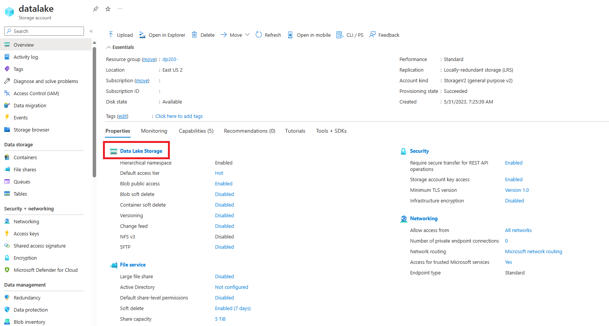
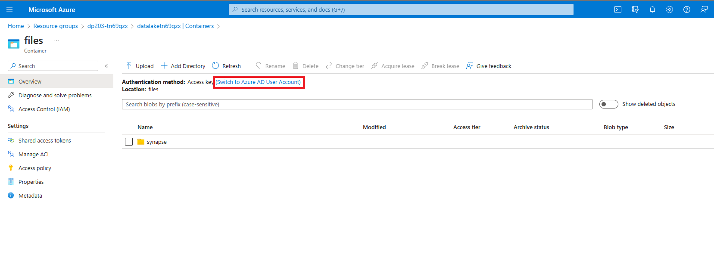

---
lab:
  title: Analisar dados em um banco de dados Lake
  ilt-use: Suggested demo
---

# Analisar dados em um banco de dados Lake

O Azure Synapse Analytics permite combinar a flexibilidade do armazenamento de arquivos em um data lake com o esquema estruturado e os recursos de consulta SQL de um banco de dados relacional por meio da capacidade de criar um *banco de dados lake*. Um banco de dados lake é um esquema de banco de dados relacional definido em um armazenamento de arquivos data lake que permite que o armazenamento de dados seja separado da computação usada para consultá-lo. Os bancos de dados Lake combinam os benefícios de um esquema estruturado que inclui suporte para tipos de dados, relações e outros recursos normalmente encontrados apenas em sistemas de banco de dados relacionais, com a flexibilidade de armazenar dados em arquivos que podem ser usados independentemente de um armazenamento de banco de dados relacional. Essencialmente, o banco de dados lake "sobrepõe" um esquema relacional em arquivos em pastas no data lake.

Este exercício deve levar aproximadamente **45** minutos para ser concluído.

## Antes de começar

É necessário ter uma [assinatura do Azure](https://azure.microsoft.com/free) com acesso de nível administrativo.

## Provisionar um workspace do Azure Synapse Analytics

Para dar suporte a um banco de dados lake, você precisa de um espaço de trabalho do Azure Synapse Analytics com acesso ao armazenamento de data lake. Não há necessidade de um pool SQL dedicado, já que você pode definir o banco de dados lake usando o pool SQL interno sem servidor. Opcionalmente, você também pode usar um pool do Spark para trabalhar com dados no banco de dados lake.

Neste exercício, você usará uma combinação de um script do PowerShell e um modelo ARM para provisionar um workspace do Azure Synapse Analytics.

1. Entre no [portal do Azure](https://portal.azure.com) em `https://portal.azure.com`.
2. Use o botão **[\>_]** à direita da barra de pesquisa na parte superior da página para criar um Cloud Shell no portal do Azure, selecionando um ambiente ***PowerShell*** e criando um armazenamento caso solicitado. O Cloud Shell fornece uma interface de linha de comando em um painel na parte inferior do portal do Azure, conforme mostrado aqui:

    

    > **Observação**: se você tiver criado anteriormente um cloud shell que usa um ambiente *Bash* , use o menu suspenso no canto superior esquerdo do painel do cloud shell para alterá-lo para ***PowerShell***.

3. Observe que você pode redimensionar o Cloud Shell arrastando a barra do separador na parte superior do painel ou usando os ícones **&#8212;** , **&#9723;** e **X** no canto superior direito do painel para minimizar, maximizar e fechar o painel. Para obter mais informações de como usar o Azure Cloud Shell, confira a [documentação do Azure Cloud Shell](https://docs.microsoft.com/azure/cloud-shell/overview).

4. No painel do PowerShell, insira os seguintes comandos para executar esse repositório:

    ```
    rm -r dp-203 -f
    git clone https://github.com/MicrosoftLearning/dp-203-azure-data-engineer dp-203
    ```

5. Depois que o repositório tiver sido clonado, digite os seguintes comandos para alterar para a pasta deste exercício e execute o script **setup.ps1** que ele contém:

    ```
    cd dp-203/Allfiles/labs/04
    ./setup.ps1
    ```

6. Se solicitado, escolha qual assinatura você deseja usar (isso só acontecerá se você tiver acesso a várias assinaturas do Azure).
7. Quando solicitado, insira uma senha adequada a ser definida para seu pool SQL do Azure Synapse.

    > **Observação**: Memorize a senha.

8. Aguarde a conclusão do script - isso normalmente leva cerca de 10 minutos, mas em alguns casos pode levar mais tempo. Enquanto você espera, revise os artigos [banco de dados Lake](https://docs.microsoft.com/azure/synapse-analytics/database-designer/concepts-lake-database) e [modelos do banco de dados Lake](https://docs.microsoft.com/azure/synapse-analytics/database-designer/concepts-database-templates) na documentação do Azure Synapse Analytics.

## Modificar permissões de contêiner

1. Depois que o script de implantação for concluído, no portal do Azure, vá para o grupo de recursos **dp203-*xxxxxxx*** que ele criou e observe que esse grupo de recursos contém seu workspace Synapse, uma conta de Armazenamento para seu data lake e um pool do Apache Spark.
1. Selecione a **Conta de armazenamento** para o data lake chamado **datalakexxxxxxx** 

     

1. Dentro do contêiner **datalakexxxxxx**, selecione a **pasta de arquivos**

    

1. Dentro da **pasta de arquivos**, você observará que o **Método de autenticação:** está listado como ***Chave de acesso (Alternar para a Conta de Usuário do Azure AD),*** clique nisso para alterar para a Conta de Usuário do Azure AD.

    
## Criar um banco de dados Lake

Um banco de dados Lake é um tipo de banco de dados que você pode definir em seu workspace e trabalhar com o pool SQL interno sem servidor.

1. Selecione seu workspace do Synapse e, em sua página **Visão geral**, no cartão **Open Synapse Studio**, selecione **Abrir** para abrir o Synapse Studio em uma nova guia do navegador, fazendo login se solicitado.
2. No lado esquerdo do Synapse Studio, use o ícone **&rsaquo;&rsaquo;** para expandir o menu, o que revela as diferentes páginas do Synapse Studio usadas para gerenciar recursos e executar tarefas de análise de dados.
3. Na página **Dados**, exiba a guia **Vinculado** e verifique se seu workspace inclui um link para sua conta de armazenamento do Azure Data Lake Storage Gen2.
4. Na página **Dados**, volte para a guia **Workspace** e observe que não há bancos de dados em seu workspace.
5. No menu **+**, selecione **Banco de dados Lake** para abrir uma nova guia na qual você pode criar seu esquema de banco de dados (aceitando os termos de uso dos modelos de banco de dados, se solicitado).
6. No painel **Propriedades** do novo banco de dados, altere o **Nome** para **RetailDB** e verifique se a propriedade **Pasta de entrada** é atualizada automaticamente para **arquivos/RetailDB**. Deixe o **Formato dos dados** como **Texto Delimitado** (você também pode usar o formato *Parquet* e substituir o formato de arquivo para tabelas individuais - usaremos dados delimitados por vírgulas neste exercício.)
7. Na parte superior do painel **RetailDB**, selecione **Publicar** para salvar o banco de dados até agora.
8. No painel **Dados** à esquerda, consulte a guia **Vinculado**. Em seguida, expanda **Azure Data Lake Storage Gen2** e o armazenamento principal **datalake*xxxxxxx***para seu espaço **synapse*xxxxxxx*** e selecione o sistema de arquivos **arquivos** que, no momento, contém uma pasta chamada **synapse**.
9.  Na guia **arquivos** que foi aberta, use o botão **+ Nova pasta** para criar uma nova pasta chamada **RetailDB** - essa será a pasta de entrada para os arquivos de dados usados por tabelas nos seus bancos de dados.

## Criar uma tabela

Agora que você criou um banco de dados lake, defina seu esquema criando tabelas.

### Definir o esquema de tabela

1. Volte para a guia **RetailDB** para sua definição de banco de dados e, na lista **+ Tabela** , selecione **Personalizado** e observe que uma nova tabela chamada **Table_1** é adicionada ao banco de dados.
2. Com **Table_1** selecionado, na guia **Geral** na tela de design do banco de dados, altere a propriedade **Name** para **Customer**.
3. Expanda a seção **Configurações de armazenamento para tabela** e observe que a tabela será armazenada como texto delimitado na pasta **files/RetailDB/Customer** no armazenamento de data lake padrão para seu workspace do Synapse.
4. Na guia **Colunas**, observe que, por padrão, a tabela contém uma coluna chamada **Column_1**. Edite a definição de coluna para corresponder às seguintes propriedades:

    | Nome | simétricas | Descrição | Nulidade | Tipo de dados | Formato / Comprimento |
    | ---- | ---- | ----------- | ----------- | --------- | --------------- |
    | CustomerId | PK &#128505; | ID de cliente exclusivo | &#128454;  | longo | |

5. Na lista **+ Coluna**, selecione **Nova coluna** e modifique a nova definição de coluna para adicionar uma coluna **FirstName** à tabela da seguinte maneira:

    | Nome | simétricas | Descrição | Nulidade | Tipo de dados | Formato / Comprimento |
    | ---- | ---- | ----------- | ----------- | --------- | --------------- |
    | CustomerId | PK &#128505; | ID de cliente exclusivo | &#128454;  | longo | |
    | **FirstName** | **PK &#128454;** | **Nome do cliente** | **&#128454;** | **cadeia de caracteres** | **256** |

6. Adicione mais novas colunas até que a definição da tabela tenha esta aparência:

    | Nome | simétricas | Descrição | Nulidade | Tipo de dados | Formato / Comprimento |
    | ---- | ---- | ----------- | ----------- | --------- | --------------- |
    | CustomerId | PK &#128505; | ID de cliente exclusivo | &#128454;  | longo | |
    | FirstName | PK &#128454; | Nome do cliente | &#128454; | string | 256 |
    | LastName | PK &#128454; | Sobrenome do cliente | &#128505; | string | 256 |
    | EmailAddress | PK &#128454; | Email do cliente | &#128454; | string | 256 |
    | o Telefone | PK &#128454; | Telefone do cliente | &#128505; | string | 256 |

7. Depois de adicionar todas as colunas, publique o banco de dados novamente para salvar as alterações.
8. No painel **Dados** à esquerda, volte para a guia **Workspace** para ver o banco dados Lake do **RetailDB**. Em seguida, expanda-o e atualize sua pasta **Tabelas** para ver a tabela **Customer** recém-criada.

### Carregar dados no caminho de armazenamento da tabela

1. No painel principal, volte para a guia **arquivos**, que contém o sistema de arquivos com a pasta **RetailDB**. Em seguida, abra a pasta **RetailDB** e crie uma nova pasta chamada **Customer** nela. É aqui que a tabela **Customer** obterá seus dados.
2. Abra a nova pasta **Customer** , que deve estar vazia.
3. Baixe o arquivo de dados **customer.csv** de [https://raw.githubusercontent.com/MicrosoftLearning/dp-203-azure-data-engineer/master/Allfiles/labs/04/data/customer.csv](https://raw.githubusercontent.com/MicrosoftLearning/dp-203-azure-data-engineer/master/Allfiles/labs/04/data/customer.csv) e salve-o em uma pasta no computador local (não importa onde). Em seguida, na pasta **Customer** no Synapse Explorer, use o botão **⤒Carregar** para carregar o arquivo **customer.csv** na pasta **RetailDB/Customer** em seu data lake.

    > **Observação**: Em um cenário de produção real, você provavelmente criaria um pipeline para ingerir dados na pasta para os dados da tabela. Estamos carregando-o diretamente na interface do usuário do Synapse Studio neste exercício por conveniência.

4. No painel de **Dados** à esquerda, na guia **Workspace**, no menu **...** para a tabela **Customer**, selecione **Novo script SQL** > **Selecionar as 100 PRIMEIRA LINHAS**. Em seguida, no novo painel **script SQL 1** que foi aberto, verifique se o pool SQL **Interno** está conectado e use o botão **▷ Executar** para executar o código SQL. Os resultados devem incluir as primeiras 100 linhas da tabela **Customer** , com base nos dados armazenados na pasta subjacente no data lake.
5. Feche a guia **script SQL 1** , descartando suas alterações.

## Criar uma tabela por meio de um modelo de banco de dados

Como você viu, você pode criar as tabelas necessárias em seu banco de dados Lake do zero. No entanto, o Azure Synapse Analytics também fornece vários modelos de banco de dados com base em cargas de trabalho e entidades de banco de dados comuns que você pode usar como ponto de partida para seu esquema de banco de dados.

### Definir o esquema de tabela

1. No painel principal, volte para o painel **RetailDB** , que contém seu esquema de banco de dados (atualmente contendo apenas a tabela **Customer**).
2. No menu **+ Tabela**, selecione **Do modelo**. Em seguida, na página **Adicionar do modelo** , selecione **Varejo** e clique em **Continuar**.
3. Na página **Adicionar do modelo (Varejo),** aguarde até que a lista de tabelas seja preenchida e, em seguida, expanda **Produto** e selecione **RetailProduct**. Clique em **Adicionar**. Isso adiciona uma nova tabela com base no modelo **RetailProduct** ao seu banco de dados.
4. No painel **RetailDB**, selecione a nova tabela **RetailProduct**. Em seguida, no painel abaixo da tela de design, na guia **Geral** , altere o nome para **Produto** e verifique se as configurações de armazenamento da tabela especificam os arquivos da pasta de entrada **files/RetailDB/Product**.
5. Na guia **Colunas** para a tabela **Produto**, observe que a tabela já inclui um grande número de colunas herdadas do modelo. Há mais colunas do que o necessário para esta tabela, então você precisará remover algumas.
6. Marque a caixa de seleção ao lado de **Nome** para selecionar todas as colunas e, em seguida <u>desmarque</u> as seguintes colunas (que você precisa reter):
    - ProductId
    - ProductName
    - IntroductionDate
    - ActualAbandonmentDate
    - ProductGrossWeight
    - ItemSku
7. Na barra de ferramentas do painel **Colunas**, selecione **Excluir** para remover as colunas selecionadas. Isso deve deixá-lo com as seguintes colunas:

    | Nome | simétricas | Descrição | Nulidade | Tipo de dados | Formato / Comprimento |
    | ---- | ---- | ----------- | ----------- | --------- | --------------- |
    | ProductId | PK &#128505; | Um identificador exclusivo para um produto. | &#128454;  | longo | |
    | ProductName | PK &#128454; | O nome do produto... | &#128505; | string | 128 |
    | IntroductionDate | PK &#128454; | A data em que o Produto foi introduzido para venda. | &#128505; | date | AAAA-MM-DD |
    | ActualAbandonmentDate | PK &#128454; | A data real em que a comercialização do produto foi interrompida... | &#128505; | date | AAA-MM-DD |
    | ProductGrossWeight | PK &#128454; | O peso bruto do produto. | &#128505; | decimal | 18,8 |
    | ItemSku | PK &#128454; | O identificador da Unidade de Manutenção de Estoque... | &#128505; | string | 20 |

8. Adicione uma nova coluna chamada **ListPrice** à tabela, conforme mostrado aqui:

    | Nome | simétricas | Descrição | Nulidade | Tipo de dados | Formato / Comprimento |
    | ---- | ---- | ----------- | ----------- | --------- | --------------- |
    | ProductId | PK &#128505; | Um identificador exclusivo para um produto. | &#128454;  | longo | |
    | ProductName | PK &#128454; | O nome do Produto... | &#128505; | string | 128 |
    | IntroductionDate | PK &#128454; | A data em que o Produto foi introduzido para venda. | &#128505; | date | AAAA-MM-DD |
    | ActualAbandonmentDate | PK &#128454; | A data real em que a comercialização do produto foi interrompida... | &#128505; | date | AAA-MM-DD |
    | ProductGrossWeight | PK &#128454; | O peso bruto do produto. | &#128505; | decimal | 18,8 |
    | ItemSku | PK &#128454; | O Identificador da Unidade de Manutenção de Estoque... | &#128505; | string | 20 |
    | **ListPrice** | **PK &#128454;** | **O preço do produto.** | **&#128454;** | **decimal** | **18,2** |

9. Quando você tiver modificado as colunas conforme mostrado acima, publique o banco de dados novamente para salvar as alterações.
10. No painel **Dados** à esquerda, volte para a guia **Workspace** para ver o banco de dados Lake **RetailDB**. Em seguida, use o menu **...** para sua pasta **Tabelas** para atualizar a exibição e ver a tabela **Produto** recém-criada.

### Carregar dados no caminho de armazenamento da tabela

1. No painel principal, volte para a guia **arquivos**, que contém o sistema de arquivos, e navegue até a pasta **files/RetailDB**, que atualmente contém a pasta **Customer** da tabela criada anteriormente.
2. Na pasta **RetailDB**, crie uma nova pasta chamada **Product**. É aqui que a tabela **Produto** obterá seus dados.
3. Abra a nova pasta **Produto** , que deve estar vazia.
4. Baixe o arquivo de dados **product.csv** de [https://raw.githubusercontent.com/MicrosoftLearning/dp-203-azure-data-engineer/master/Allfiles/labs/04/data/product.csv](https://raw.githubusercontent.com/MicrosoftLearning/dp-203-azure-data-engineer/master/Allfiles/labs/04/data/product.csv) em uma pasta no computador local (não importa onde). Em seguida, na pasta **Produto** no Synapse Explorer, use o botão **⤒Carregar** para carregar o arquivo **product.csv** na pasta **RetailDB/Product** em seu data lake.
5. No painel **Dados** à esquerda, na guia **Workspace**, no menu **...** para a tabela **Produto**, selecione **Novo script SQL** > **Selecionar as 100 PRIMEIRAS LINHAS**. Em seguida, no novo painel **script de SQL 1** que foi aberto, verifique se o pool SQL **Interno** está conectado e use o botão **▷ Executar** para executar o código SQL. Os resultados devem incluir as primeiras 100 linhas da tabela **Produto**, com base nos dados armazenados na pasta subjacente no data lake.
6. Feche a guia **script do SQL 1**, descartando suas alterações.

## Criar uma tabela a partir de dados existentes

Até agora, você criou tabelas e as preencheu com dados. Em alguns casos, talvez você já tenha dados em um data lake do qual deseja derivar uma tabela.

### Carregar dados

1. No painel principal, volte para a guia **Arquivos**, que contém o sistema de arquivos, e navegue até a pasta **files/RetailDB**, que atualmente contém as pastas **Cliente** e **Produto** para as tabelas criadas anteriormente.
2. Na pasta **RetailDB**, crie uma nova pasta chamada **SalesOrder**.
3. Abra a nova pasta **SalesOrder**, que deve estar vazia.
4. Baixe o arquivo de dados **salesorder.csv** de[https://raw.githubusercontent.com/MicrosoftLearning/dp-203-azure-data-engineer/master/Allfiles/labs/04/data/salesorder.csv](https://raw.githubusercontent.com/MicrosoftLearning/dp-203-azure-data-engineer/master/Allfiles/labs/04/data/salesorder.csv) e salve-o em uma pasta no computador local (não importa onde). Em seguida, na pasta **SalesOrder** no Synapse Explorer, use o botão **⤒ Carregar** para carregar o arquivo **salesorder.csv** para a pasta **RetailDB/SalesOrder** em seu data lake.

### Criar uma tabela

1. No painel principal, volte para o painel **RetailDB**, que contém o esquema de banco de dados (atualmente contendo as tabelas **Cliente** e **Produto**).
2. No menu **+ Tabela**, selecione **Do data lake**. Em seguida, no painel **Criar tabela externa a partir do data lake**, especifique as seguintes opções:
    - **Nome da tabela externa**: SalesOrder
    - **Serviço vinculado**: Selecione **synapse*xxxxxxx*-WorkspaceDefautStorage(datalake*xxxxxxx*)**
    - **Arquivo de entrada da pasta**: files/RetailDB/SalesOrder
3. Continue para a próxima página e crie a tabela com as seguintes opções:
    - **Tipo de arquivo**: CSV
    - **Terminador do campo**: Padrão (vírgula ,)
    - **Primeira linha**: deixe os *nomes da coluna de inferência*<u>des</u>marcados.
    - **Delimitador de cadeia de caracteres**: Padrão (Cadeia de caracteres vazia)
    - **Usar tipo padrão**: Tipo padrão (true,false)
    - **Comprimento máx. da cadeia de caracteres**: 4000

4. Quando a tabela tiver sido criada, observe que ela inclui colunas chamadas **C1**, **C2** e assim por diante e que os tipos de dados foram inferidos dos dados na pasta. Modifique as definições de coluna da seguinte maneira:

    | Nome | simétricas | Descrição | Nulidade | Tipo de dados | Formato / Comprimento |
    | ---- | ---- | ----------- | ----------- | --------- | --------------- |
    | SalesOrderId | PK &#128505; | O identificador exclusivo de um pedido. | &#128454;  | longo | |
    | OrderDate | PK &#128454; | São os dados do pedido. | &#128454; | timestamp | yyyy-MM-dd |
    | LineItemId | PK &#128505; | A ID de um item de linha individual. | &#128454; | longo | |
    | CustomerId | PK &#128454; | O cliente. | &#128454; | longo | |
    | ProductId | PK &#128454; | O produto. | &#128454; | longo | |
    | Quantidade | PK &#128454; | A quantidade do pedido. | &#128454; | longo | |

    > **Observação**: A tabela contém um registro para cada item individual solicitado e inclui uma chave primária composta por **SalesOrderId** e **LineItemId**.

5. Na guia **Relações** para a tabela **SalesOrder**, na lista **+ Relação**, selecione **Para a tabela** e, em seguida, define a relação a seguir:

    | Da tabela | Da coluna | Para a tabela | Para a coluna |
    | ---- | ---- | ----------- | ----------- |
    | Cliente | CustomerId | Pedido de Venda | CustomerId |

6. Adicione uma segunda relação *Para a tabela* com as seguintes configurações:

    | Da tabela | Da coluna | Para a tabela | Para a coluna |
    | ---- | ---- | ----------- | ----------- |
    | Product | ProductId | Pedido de Venda | ProductId |

    A capacidade de definir relações entre tabelas ajuda a impor a integridade referencial entre entidades de dados relacionadas. Esse é um recurso comum de bancos de dados relacionais que, de outra forma, seria difícil de aplicar a arquivos em um data lake.

7. Publique o banco de dados novamente para salvar as alterações.
8. No painel **Dados** à esquerda, volte para a guia **Workspace** para ver o banco de dados Lake **RetailDB**. Em seguida, use o menu **...** para a pasta **Tabelas** para atualizar a exibição e ver a tabela **SalesOrder** recém-criada.

## Trabalhar com tabelas de banco de dados Lake

Agora que você tem algumas tabelas em seu banco de dados, pode usá-las para trabalhar com os dados subjacentes.

### Consultar tabelas usando SQL

1. No Synapse Studio, selecione a página **Desenvolver**.
2. No painel **Desenvolver**, no menu **+**, selecione **Script de SQL**.
3. No novo painel **script de SQL 1**, verifique se o script está conectado ao pool de SQL **Interno** e, na lista **Banco de dados do usuário**, selecione **RetailDB**.
4. Insira o seguinte código SQL:

    ```sql
    SELECT o.SalesOrderID, c.EmailAddress, p.ProductName, o.Quantity
    FROM SalesOrder AS o
    JOIN Customer AS c ON o.CustomerId = c.CustomerId
    JOIN Product AS p ON o.ProductId = p.ProductId
    ```

5. Use o botão **▷ Executar** para executar o código SQL.

    Os resultados mostram detalhes do pedido com informações do cliente e do produto.

6. Feche o painel do **script SQL 1** , descartando suas alterações.

### Inserir dados usando o Spark

1. No painel **Desenvolver**, no menu **+**, selecione **Notebook**.
2. No novo painel **Notebook 1**, conecte o notebook ao pool Spark *spark*xxxxxxx****.
3. Execute o seguinte código em uma célula vazia do notebook:

    ```
    %%sql
    INSERT INTO `RetailDB`.`SalesOrder` VALUES (99999, CAST('2022-01-01' AS TimeStamp), 1, 6, 5, 1)
    ```

4. Use o botão **▷** à esquerda da célula para executá-lo e aguarde até que ele termine de ser executado. Observe que levará algum tempo para iniciar o pool do Spark.
5. Use o botão **+ Código** para adicionar uma nova célula ao bloco de anotações.
6. Na nova célula, insira o código a seguir:

    ```
    %%sql
    SELECT * FROM `RetailDB`.`SalesOrder` WHERE SalesOrderId = 99999
    ```
7. Use o botão **▷** à esquerda da célula para executá-lo e verificar se uma linha para a ordem do cliente 99999 foi inserida na tabela **SalesOrder**.
8. Feche o painel **Notebook 1**, interrompendo a sessão do Spark, e descarte as alterações.

## Excluir recursos do Azure

Se você terminou de explorar Azure Synapse Analytics, exclua os recursos que criou para evitar custos desnecessários do Azure.

1. Feche a guia do navegador do Synapse Studio e retorne ao portal do Azure.
2. No portal do Azure, na **Página Inicial**, selecione **Grupos de recursos**.
3. Selecione o grupo de recursos **dp203-*xxxxxxx*** para o workspace do Synapse Analytics (não o grupo de recursos gerenciado) e verifique se ele contém o workspace do Synapse, a conta de armazenamento e o pool do Spark para seu workspace.
4. Na parte superior da página de **Visão Geral** do grupo de recursos, selecione **Excluir o grupo de recursos**.
5. Digite o nome do grupo de recursos **dp203-*xxxxxxx*** para confirmar que deseja excluí-lo e selecione **Excluir**.

    Após alguns minutos, seu grupo de recursos do workspace do Azure Synapse e o grupo de recursos do workspace gerenciado associado a ele serão excluídos.
