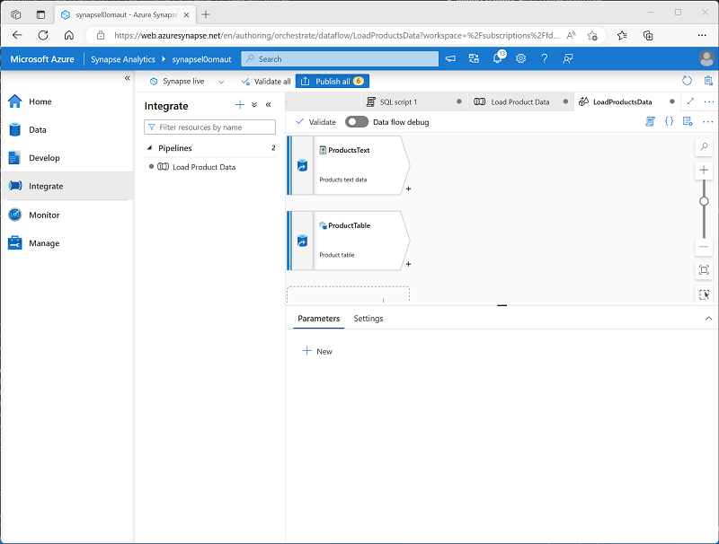

---
lab:
  title: Criar um pipeline de dados no Azure Synapse Analytics
  ilt-use: Lab
---

# Criar um pipeline de dados no Azure Synapse Analytics

Neste exercício, você carregará dados em um Pool de SQL dedicado usando um pipeline no Azure Synapse Analytics Explorer. O pipeline encapsulará um fluxo de dados que carrega dados do produto em uma tabela em um data warehouse.

Este exercício deve levar aproximadamente **45** minutos para ser concluído.

## Antes de começar

É necessário ter uma [assinatura do Azure](https://azure.microsoft.com/free) com acesso de nível administrativo.

## Provisionar um workspace do Azure Synapse Analytics

Você precisará de um workspace do Azure Synapse Analytics com acesso ao armazenamento de data lake e um pool de SQL dedicado hospedando um data warehouse relacional.

Neste exercício, você usará uma combinação de um script do PowerShell e um modelo ARM para provisionar um workspace do Azure Synapse Analytics.

1. Entre no [portal do Azure](https://portal.azure.com) em `https://portal.azure.com`.
2. Use o botão **[\>_]** à direita da barra de pesquisa na parte superior da página para criar um Cloud Shell no portal do Azure, selecionando um ambiente ***PowerShell*** e criando armazenamento caso solicitado. O Cloud Shell fornece uma interface de linha de comando em um painel na parte inferior do portal do Azure, conforme mostrado aqui:

    

    > **Observação**: se você tiver criado anteriormente um cloud shell que usa um ambiente *Bash*, use o menu suspenso no canto superior esquerdo do painel do cloud shell para alterá-lo para ***PowerShell***.

3. Observe que você pode redimensionar o Cloud Shell arrastando a barra do separador na parte superior do painel ou usando os ícones —, **◻** e **X** no canto superior direito do painel para minimizar, maximizar e fechar o painel. Para obter mais informações de como usar o Azure Cloud Shell, confira a [documentação do Azure Cloud Shell](https://docs.microsoft.com/azure/cloud-shell/overview).

4. No painel do PowerShell, insira os seguintes comandos para clonar este repositório:

    ```powershell
    rm -r dp-203 -f
    git clone https://github.com/MicrosoftLearning/dp-203-azure-data-engineer dp-203
    ```

5. Depois que o repositório tiver sido clonado, digite os seguintes comandos para alterar para a pasta deste exercício e execute o script **setup.ps1** que ele contém:

    ```powershell
    cd dp-203/Allfiles/labs/10
    ./setup.ps1
    ```

6. Se solicitado, escolha qual assinatura você deseja usar (isso só acontecerá se você tiver acesso a várias assinaturas do Azure).
7. Quando solicitado, insira uma senha adequada a ser definida para seu pool de SQL do Azure Synapse.

    > **Observação**: Memorize a senha.

8. Aguarde a conclusão do script – isso normalmente leva cerca de 10 minutos, mas em alguns casos pode levar mais tempo. Enquanto espera, revise o artigo [Fluxos de dados no Azure Synapse Analytics](https://learn.microsoft.com/azure/synapse-analytics/concepts-data-flow-overview) na documentação do Azure Synapse Analytics.

## Ver armazenamentos de dados de origem e destino

Os dados de origem para este exercício são um arquivo de texto que contém dados do produto. O destino é uma tabela em um pool de SQL dedicado. Seu objetivo é criar um pipeline que encapsula um fluxo de dados no qual os dados do produto no arquivo são carregados na tabela; inserção de novos produtos e atualização dos já existentes.

1. Depois que o script for concluído, no portal do Azure, vá para o grupo de recursos **dp203-*xxxxxxx*** que ele criou e selecione seu workspace do Synapse.
2. Na página **Visão Geral** do seu Workspace do Synapse, no cartão **Open Synapse Studio**, selecione **Abrir** para abrir o Synapse Studio em uma nova guia do navegador; entrando caso necessário.
3. No lado esquerdo do Synapse Studio, use o ícone ›› para expandir o menu. São mostradas as diferentes páginas do Synapse Studio que você usará para gerenciar recursos e executar tarefas de análise de dados.
4. Na página **Gerenciar**, na guia **pools de SQL**, selecione a linha do pool de SQL dedicado **sql*xxxxxxx*** e use seu ícone **▷** para iniciá-lo, confirmando que você deseja retomá-lo quando solicitado.

     A retomada de um pool pode levar alguns minutos. Você pode usar o botão **↻ Atualizar** para verificar seu status periodicamente. O status será exibido como **Online** quando estiver pronto. Enquanto aguarda, continue com as etapas abaixo para exibir os dados de origem.

5. Na página **Dados**, exiba a guia **Vinculado** e verifique se seu workspace inclui um link para sua conta de armazenamento do Azure Data Lake Storage Gen2, que deve ter um nome semelhante a **synapse*xxxxxxx* (Principal - datalake*xxxxxxx*)**.
6. Expanda sua conta de armazenamento e verifique se ela contém um contêiner do sistema de arquivos chamado **arquivos (principal).**
7. Selecione o contêiner de arquivos e observe que ele contém uma pasta chamada **dados**.
8. Abra a pasta de **dados** e observe o arquivo **Product.csv** que ela contém.
9. Clique com o botão direito do mouse em **Product.csv** e selecione **Visualizar** para ver os dados que ele contém. Observe que ele contém uma linha de cabeçalho e alguns registros de dados do produto.
10. Retorne à página **Gerenciar** e verifique se o pool SQL dedicado agora está online. Se não, aguarde.
11. Na página **Dados**, na guia **Workspace**, expanda **banco de dados SQL**, seu banco de dados **sql*xxxxxxx* (SQL)** e as **Tabelas**.
12. Selecione a tabela **dbo.DimProduct**. Em seguida, em seu menu **...**, selecione **Novo script SQL** > **Selecionar as 100 PRIMEIRAS LINHAS**, que executará uma consulta que retorna os dados do produto da tabela - deve haver uma única linha.

## Implementar um pipeline

Para carregar os dados no arquivo de texto na tabela do banco de dados, você implementará um pipeline do Azure Synapse Analytics que contém um fluxo de dados encapsulando a lógica para ingerir os dados do arquivo de texto, pesquise na coluna alternativa **ProductKey** por porodutos que já existem no banco de dados e insira ou atualize as linhas na tabela de acordo.

### Criar um pipeline com uma atividade de fluxo de dados

1. No Synapse Studio, selecione a página **Integrar**. Em seguida, no menu **+**, selecione **Pipeline** para criar um novo pipeline.
2. No painel **Propriedades** do novo pipeline, altere seu nome de **Pipeline1** para **Carregar Dados do Produto**. Em seguida, use o botão **Propriedades** acima do painel **Propriedades** para ocultá-lo.
3. No painel **Atividades**, expanda **Mover e transformar**; e, em seguida, arraste **Fluxo de dados** para a superfície de design de pipeline, conforme mostrado aqui:

    

4. Na superfície de design do pipeline, na guia **Geral**, defina a propriedade **Nome** como **LoadProducts**.
5. Na guia **Configurações**, na parte inferior da lista de configurações, expanda **Preparo** e defina as seguintes configurações de preparo:
    - **Serviço vinculado de preparo**: Selecione o serviço vinculado **synapse*xxxxxxx*-WorkspaceDefaultStorage**.
    - **Pasta de armazenamento de preparo**: Defina **contêiner** como **arquivos** e **Diretório** para **stage_products**.

### Configurar o fluxo de dados

1. Na parte superior da guia **Configurações** para o fluxo de dados **LoadProducts**, para a propriedade **Fluxo de dados**, selecione **+ New**.
2. No painel **Propriedades** para a nova superfície de design do fluxo de dados que se abrir, defina o **Nome** como **LoadProductsData** e, em seguida, oculte o painel **Propriedades**. O designer de fluxo de dados deve ter esta aparência:

    

### Adicionar fontes

1. Na superfície de design do fluxo de dados, na lista suspensa **Adicionar Origem**, selecione **Adicionar Origem**. Em seguida, defina as configurações de origem da seguinte forma:
    - **Nome do fluxo de saída**: ProductsText
    - **Descrição**: Dados de texto dos produtos
    - **Tipo de origem**: conjunto de dados de integração
    - **Conjunto de dados**: adicione um **Novo** conjunto de dados com as seguintes propriedades:
        - **Tipo**: Azure Datalake Storage Gen2
        - **Formato**: Texto Delimitado
        - **Nome**: Products_Csv
        - **Serviço Vinculado**: synapse*xxxxxxx*-WorkspaceDefaultStorage
        - **Caminho do arquivo**: files/data/Product.csv
        - **Primeira linha como cabeçalho**: Selecionada
        - **Esquema de importação**: de conexão/armazenamento
    - **Permitir desvio de esquema**: selecionado
2. Na guia **Projeção** para a nova origem **ProductsText**, defina os seguintes tipos de dados:
    - **ProductID**: cadeia de caracteres
    - **ProductName**: cadeia de caracteres
    - **Cor**: cadeia de caracteres
    - **Tamanho**: cadeia de caracteres
    - **ListPrice**: decimal
    - **Descontinuado**: booleano
3. Adicione uma segunda origem com as propriedades a seguir:
    - **Nome do fluxo de saída**: ProductTable
    - **Descrição**: Tabela de produtos
    - **Tipo de origem**: conjunto de dados de integração
    - **Conjunto de dados**: adicione um **Novo** conjunto de dados com as seguintes propriedades:
        - **Tipo**: Azure Synapse Analytics
        - **Nome**: DimProduct
        - **Serviço vinculado**: crie um **novo** serviço vinculado com as seguintes propriedades:
            - **Nome**: Data_Warehouse
            - **Descrição**: Pool de SQL dedicado
            - **Conectar por meio de runtime de integração**: AutoResolveIntegrationRuntime
            - **Versão**: Herdada
            - **Método de seleção de conta**: Da assinatura Azure
            - **Assinatura do Azure**: selecione sua assinatura do Azure
            - **Nome do servidor**: synapse*xxxxxxx* (workspace do Synapse)
            - **Nome do banco de dados**: sql*xxxxxxx*
            - <bpt ctype="x-unknown" id="1" rid="1"><bpt xmlns="urn:oasis:names:tc:xliff:document:1.2" id="p1">**</bpt></bpt>SQL pool<ept id="2" rid="1"><ept xmlns="urn:oasis:names:tc:xliff:document:1.2" id="p1">**</ept></ept>: sql<bpt ctype="x-unknown" id="3" rid="2"><bpt xmlns="urn:oasis:names:tc:xliff:document:1.2" id="p2">*</bpt></bpt>xxxxxxx<ept id="4" rid="2"><ept xmlns="urn:oasis:names:tc:xliff:document:1.2" id="p2">*</ept></ept><ph ctype="x-unknown" id="5"><ph xmlns="urn:oasis:names:tc:xliff:document:1.2" id="ph1">
            </ph></ph><bpt ctype="x-unknown" id="6" rid="3"><bpt xmlns="urn:oasis:names:tc:xliff:document:1.2" id="p3">**</bpt></bpt>Authentication type<ept id="7" rid="3"><ept xmlns="urn:oasis:names:tc:xliff:document:1.2" id="p3">**</ept></ept>: Identidade Gerenciada Atribuída ao Sistema
        - **Nome da tabela**: dbo.DimProduct
        - **Esquema de importação**: de conexão/armazenamento
    - **Permitir desvio de esquema**: selecionado
4. Na guia **Projeção** da nova fonte **ProductTable**, verifique se os seguintes tipos de dados estão definidos:
    - **ProductKey**: inteiro
    - **ProductAltKey**: cadeia de caracteres
    - **ProductName**: cadeia de caracteres
    - **Cor**: cadeia de caracteres
    - **Tamanho**: cadeia de caracteres
    - **ListPrice**: decimal
    - **Descontinuado**: booleano
5. Verifique se o fluxo de dados contém duas fontes, conforme mostrado aqui:

    

### Adicionar uma Pesquisa

1. Selecione o ícone **+** no canto inferior direito da origem **ProductsText** e selecione **Pesquisar**.
2. Defina as configurações de Pesquisa da seguinte forma:
    - **Nome do fluxo de saída**: MatchedProducts
    - **Descrição**: Dados do produto correspondentes
    - **Fluxo primário**: ProductText
    - **Fluxo de pesquisa**: ProductTable
    - **Corresponder várias linhas**: <u>Não</u> selecionado
    - **Correspondência em**: Última linha
    - **Condições de classificação**: ProductKey ascendente
    - **Condições de pesquisa**: ProductID == ProductAltKey
3. Verifique se o fluxo de dados tem a seguinte aparência:

    

    A pesquisa retorna um conjunto de colunas de *ambas* as fontes, essencialmente formando uma junção externa que corresponde à coluna **ProductID** no arquivo de texto à coluna **ProductAltKey** na tabela do data warehouse. Quando um produto com a chave alternativa já existe na tabela, o conjunto de dados incluirá os valores de ambas as fontes. Quando o produto ainda não existir no data warehouse, o conjunto de dados conterá valores NULL para as colunas da tabela.

### Adicionar uma Alteração de Linha

1. Selecione o ícone **+** no canto inferior direito da Pesquisa **MatchedProducts** e selecione **Alterar Linha**.
2. Defina as configurações de alteração de linha da seguinte forma:
    - **Nome do fluxo de saída**: SetLoadAction
    - **Descrição**: Inserir upsert novo e upsert existente
    - **Fluxo de entrada**: MatchedProducts
    - **Condições de alteração de linha**: edite a condição existente e use o botão **+** para adicionar uma segunda condição da seguinte maneira (observe que as expressões *diferenciam maiúsculas de minúsculas*):
        - InsertIf: `isNull(ProductKey)`
        - UpsertIf: `not(isNull(ProductKey))`
3. verifique se o fluxo de dados tem esta aparência:

    

    A etapa de alteração de linha configura o tipo de ação de carregamento a ser executada para cada linha. Onde não houver nenhuma linha existente na tabela (o **ProductKey** é NULL), a linha do arquivo de texto será inserida. Onde já houver uma linha para o produto, um *upsert* será executado para atualizar a linha existente. Essa configuração aplica essencialmente uma *atualização de dimensão do tipo 1 que muda lentamente*.

### Adicionar um coletor

1. Selecione o ícone **+** no canto inferior direito da etapa de alteração de linha **SetLoadAction** e selecione **Coletor**.
2. Configure as propriedades do **Coletor** da seguinte maneira:
    - **Nome do fluxo de saída**: DimProductTable
    - **Descrição**: Carregar tabela DimProduct
    - **Fluxo de entrada**: SetLoadAction
    - **Tipo de coletor**: conjunto de dados de integração
    - **Conjunto de dados**: DimProduct
    - **Permitir desvio de esquema**: selecionado
3. Na guia **Configurações** do novo coletor **DimProductTable**, especifique as seguintes configurações:
    - **Método de atualização**: selecione **Permitir inserção** e **Permitir Upsert**.
    - **Colunas de chaves**: selecione **Lista de colunas** e, em seguida, selecione a coluna **ProductAltKey**.
4. Na guia **Mapeamentos** do novo coletor **DimProductTable**, desmarque a caixa de seleção **Mapeamento automático** e especifique <u>apenas</u> os seguintes mapeamentos de coluna:
    - ProductID: ProductAltKey
    - ProductsText@ProductName: ProductName
    - ProductsText@Color: Cor
    - ProductsText@Size: Tamanho
    - ProductsText@ListPrice: ListPrice
    - ProductsText@Discontinued: Descontinuado
5. Verifique se o fluxo de dados tem a seguinte aparência:

    

## Depurar o Fluxo de Dados

Agora que você criou um fluxo de dados em um pipeline, pode depurá-lo antes de publicá-lo.

1. Na parte superior do designer de fluxo de dados, habilite a **Depuração de fluxo de dados**. Revise a configuração padrão e selecione **OK** e aguarde até que o cluster de depuração seja iniciado (o que pode levar alguns minutos).
2. No designer de fluxo de dados, selecione o coletor **DimProductTable** e exiba sua guia **Visualização de dados**.
3. Use o botão **↻ Atualizar** para atualizar a visualização, que tem o efeito de executar dados através do fluxo de dados para depurá-los.
4. Analise os dados de visualização, observando que eles indicam uma linha atualizada (para o produto *AR5381*), indicada por um ícone **<sub>*</sub><sup>+</sup>** e dez linhas inseridas, indicadas por um ícone **+**.

## Publicar e executar o pipeline

Agora você está pronto para publicar e executar o pipeline.

1. Use o botão **Publicar tudo** para publicar o pipeline (e quaisquer outros ativos não salvos).
2. Quando a publicação estiver concluída, feche o painel de fluxo de dados **LoadProductsData** e retorne ao painel de pipeline **Load Product Data**.
3. Na parte superior do painel do designer de pipeline, no menu **Adicionar gatilho**, selecione **Acionar agora**. Em seguida, selecione **OK** para confirmar que deseja executar o pipeline.

    **Observação**: você também pode criar um gatilho para executar o pipeline em um horário agendado ou em resposta a um evento específico.

4. Quando o pipeline tiver começado a ser executado, na página **Monitor**, exiba a guia **Execuções de pipeline** e revise o status do pipeline **Carregar Dados do Produto**.

    O pipeline pode levar cinco minutos ou mais para ser concluído. Você pode usar o botão **↻ Atualizar** na barra de ferramentas para verificar seu status.

5. Quando a execução do pipeline for bem-sucedida, na página **Dados**, use o menu **...** para a tabela **dbo.DimProduct** no banco de dados SQL para executar uma consulta que seleciona as 100 primeiras linhas. A tabela deve conter os dados carregados pelo pipeline.
   
## Excluir recursos do Azure

Se você terminou de explorar Azure Synapse Analytics, exclua os recursos que criou para evitar custos desnecessários do Azure.

1. Feche a guia do navegador do Synapse Studio e retorne ao portal do Azure.
2. No portal do Azure, na **Página Inicial**, selecione **Grupos de recursos**.
3. Selecione o grupo de recursos **dp203-*xxxxxxx*** para o workspace do Synapse Analytics (não o grupo de recursos gerenciado) e verifique se ele contém o workspace do Synapse, a conta de armazenamento e o pool de SQL para seu workspace.
4. Na parte superior da página de **Visão Geral** do grupo de recursos, selecione **Excluir o grupo de recursos**.
5. Digite o nome do grupo de recursos **dp203-*xxxxxxx*** para confirmar que deseja excluí-lo e selecione **Excluir**.

    Após alguns minutos, o grupo de recursos de seu workspace do Azure Synapse e o grupo de recursos do workspace gerenciado associado a ele serão excluídos.
