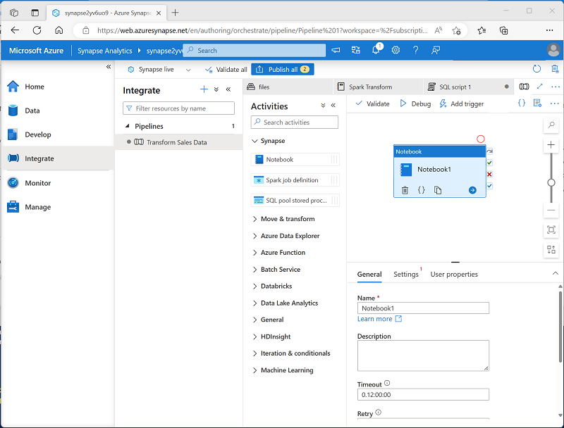

---
lab:
  title: Usar um notebook do Apache Spark em um pipeline
  ilt-use: Lab
---

# Usar um notebook do Apache Spark em um pipeline

Neste exercício, vamos criar um pipeline do Azure Synapse Analytics que inclui uma atividade para executar um notebook do Apache Spark.

Este exercício deve levar aproximadamente **30** minutos para ser concluído.

## Antes de começar

É necessário ter uma [assinatura do Azure](https://azure.microsoft.com/free) com acesso de nível administrativo.

## Provisionar um workspace do Azure Synapse Analytics

Você precisará de um workspace do Azure Synapse Analytics com acesso ao armazenamento de data lake e um pool do Spark.

Neste exercício, você usará uma combinação de um script do PowerShell e um modelo ARM para provisionar um workspace do Azure Synapse Analytics.

1. Entre no [portal do Azure](https://portal.azure.com) em `https://portal.azure.com`.
2. Use o botão **[\>_]** à direita da barra de pesquisa na parte superior da página para criar um Cloud Shell no portal do Azure, selecionando um ambiente ***PowerShell*** e criando armazenamento caso solicitado. O Cloud Shell fornece uma interface de linha de comando em um painel na parte inferior do portal do Azure, conforme mostrado aqui:

    

    > **Observação**: se você tiver criado anteriormente um cloud shell que usa um ambiente *Bash*, use o menu suspenso no canto superior esquerdo do painel do cloud shell para alterá-lo para ***PowerShell***.

3. Observe que você pode redimensionar o Cloud Shell arrastando a barra do separador na parte superior do painel ou usando os ícones —, **◻** e **X** no canto superior direito do painel para minimizar, maximizar e fechar o painel. Para obter mais informações de como usar o Azure Cloud Shell, confira a [documentação do Azure Cloud Shell](https://docs.microsoft.com/azure/cloud-shell/overview).

4. No painel do PowerShell, insira os seguintes comandos para clonar este repositório:

    ```powershell
    rm -r dp-203 -f
    git clone https://github.com/MicrosoftLearning/dp-203-azure-data-engineer dp-203
    ```

5. Depois que o repositório tiver sido clonado, digite os seguintes comandos para alterar para a pasta deste exercício e execute o script **setup.ps1** que ele contém:

    ```powershell
    cd dp-203/Allfiles/labs/11
    ./setup.ps1
    ```
    
6. Se solicitado, escolha qual assinatura você deseja usar (isso só acontecerá se você tiver acesso a várias assinaturas do Azure).
7. Quando solicitado, insira uma senha adequada a ser definida para seu pool de SQL do Azure Synapse.

    > **Observação**: Memorize a senha.

8. Aguarde a conclusão do script – isso normalmente leva cerca de 10 minutos, mas em alguns casos pode levar mais tempo. Enquanto espera, revise o artigo [Azure Synapse Pipelines](https://learn.microsoft.com/en-us/azure/data-factory/concepts-data-flow-performance-pipelines) na documentação do Azure Synapse Analytics.

## Executar um notebook do Spark interativamente

Antes de automatizar um processo de transformação de dados com um bloco de anotações, pode ser útil executar o bloco de anotações interativamente para entender melhor o processo que você automatizará posteriormente.

1. Depois que o script for concluído, no portal do Azure, vá para o grupo de recursos dp203-xxxxxxx que ele criou e selecione seu workspace do Synapse.
2. Na página **Visão Geral** do seu Workspace do Synapse, no cartão **Open Synapse Studio**, selecione **Abrir** para abrir o Synapse Studio em uma nova guia do navegador; entrando caso necessário.
3. No lado esquerdo do Synapse Studio, use o ícone ›› para expandir o menu. São mostradas as diferentes páginas do Synapse Studio.
4. Na página **Dados**, exiba a guia Vinculado e verifique se workspace inclui um link para sua conta de armazenamento do Azure Data Lake Storage Gen2, que deve ter um nome semelhante a **synapsexxxxxxx (Principal - datalakexxxxxxx)**.
5. Expanda sua conta de armazenamento e verifique se ela contém um contêiner do sistema de arquivos chamado **arquivos (principal).**
6. Selecione o contêiner de arquivos e observe que ele contém uma pasta chamada **data**, que contém os arquivos de dados que você vai transformar.
7. Abra a pasta **data**** e visualize os arquivos CSV que ela contém. Clique com o botão direito do mouse em qualquer um dos arquivos e selecione **Visualizar** para ver uma amostra dos dados. Feche a visualização quando terminar.
8. Clique com o botão direito do mouse em qualquer um dos arquivos e selecione **Visualizar** para ver os dados que ele contém. Observe que os arquivos contêm uma linha de cabeçalho; você pode selecionar a opção para exibir cabeçalhos de coluna.
9. Feche a versão preliminar. Em seguida, baixe o **Spark Transform.ipynb** [de Allfiles/labs/11/notebooks](https://github.com/MicrosoftLearning/dp-203-azure-data-engineer/tree/master/Allfiles/labs/11/notebooks)

    > **Observação**: é melhor copiar este texto usando ***ctrl + a*** seguido de ***ctrl + c*** e colar em uma ferramenta (como o bloco de notas ) usando ***ctrl + v***; em seguida, usando arquivo, salvar como **Spark Transform.ipynb** com tipo de arquivo definido como ***todos os arquivos***. Você também tem a opção de selecionar o arquivo no GitHub e, em seguida, selecionar as reticências (...) e selecionar **Baixar**, salvando-o em um local que você possa lembrar. 
    

10 Em seguida, na página **Desenvolver**, expanda **Notebooks**, clique nas opções 
    
        
1. Selecione o arquivo que você acabou de baixar e salvar como **Spark Transfrom.ipynb**.
2. Conecte o notebook ao seu pool do Spark **spark*xxxxxxx***.
3. Revise as anotações no notebook e execute as células de código.

    > **Observação**: a primeira célula de código levará alguns minutos para ser executada porque o pool do Spark deve ser iniciado. As células subsequentes serão executadas mais rapidamente.
4. Revise o código que o notebook contém, observando que:
    - Define uma variável para definir um nome de pasta exclusivo.
    - Carrega os dados da ordem de venda CSV da pasta **/data**.
    - Transforma os dados dividindo o nome do cliente em vários campos.
    - Salva os dados transformados no formato Parquet na pasta com nome exclusivo.
5. Na barra de ferramentas do notebook, anexe o notebook ao pool do Spark **spark*xxxxxxx*** e use o botão **▷ Executar Tudo** para executar todas as células de código no notebook.
  
    A sessão do Spark pode levar alguns minutos para iniciar antes que as células de código possam ser executadas.

6. Depois que todas as células do notebook forem executadas, observe o nome da pasta na qual os dados transformados foram salvos.
7. Alterne para a guia de **arquivos** (que ainda deve estar aberta) e visualize a pasta de **arquivos** raiz. Se necessário, no menu **Mais**, selecione **Atualizar** para ver a nova pasta. Em seguida, abra-a para verificar se ela contém arquivos Parquet.
8. Retorne à pasta de **arquivos** raiz, selecione a pasta com nome exclusivo gerada pelo notebook e, no menu **Novo Script SQL**, selecione **Selecionar as 100 PRIMEIRAS LINHAS**.
9. No painel **Selecionar as 100 PRIMEIRAS LINHAS**, defina o tipo de arquivo como **formato Parquet** e aplique a mudança.
10. No novo painel Script SQL que é aberto, use o botão **▷ Executar** para executar o código SQL e verificar se ele retorna os dados da ordem de venda transformados.

## Executar o notebook em um pipeline

Agora que você entende o processo de transformação, está pronto para automatizá-lo encapsulando o notebook em um pipeline.

### Criar uma célula de parâmetros

1. No Synapse Studio, retorne à guia **Spark Transform** que contém o notebook e, na barra de ferramentas, no menu **...** na extremidade direita, selecione **Limpar saída**.
2. Selecione a primeira célula de código (que contém o código para definir a variável **folderName**).
3. Na barra de ferramentas pop-up no canto superior direito da célula de código, no menu **...**, selecione **\[@] Alternar célula de parâmetro**. Verifique se a palavra **parâmetros** aparece na parte inferior direita da célula.
4. Na barra de ferramentas, use o botão **Publicar** para salvar as alterações.

### Criar um pipeline

1. No Synapse Studio, selecione a página **Integrar**. Em seguida, no menu **+**, selecione **Pipeline** para criar um novo pipeline.
2. No painel **Propriedades** do novo pipeline, altere seu nome de **Pipeline1** para **Transformar Dados de Vendas**. Em seguida, use o botão **Propriedades** acima do painel **Propriedades** para ocultá-lo.
3. No painel **Atividades**, expanda **Synapse** e, em seguida, arraste uma atividade de **Notebook** para a superfície de design do pipeline, conforme mostrado aqui:

    

4. 
5. Na guia **Geral** da atividade Notebook, altere seu nome para **Executar Transformação do Spark**.
6. Na guia **Configurações** da atividade do Notebook, defina as seguintes propriedades:
    - **Notebook**: Selecione o notebook **Transformação do Spark**.
    - **Parâmetros básicos**: expanda esta seção e defina um parâmetro com as seguintes configurações:
        - **Nome**: folderName
        - **Tipo:** string
        - **Valor**: Selecione **Adicionar conteúdo dinâmico** e defina o valor do parâmetro para a variável do sistema *ID de Execução do Pipeline* (`@pipeline().RunId`)
    - **Pool do Spark**: Selecione o pool **spark*xxxxxxx***.
    - **Tamanho do executor**: Selecione **Small (4 vCores, Memória de 28GB)**.

    Seu painel de pipeline deve ser semelhante a este:

    

### Publicar e executar o pipeline

1. Use o botão **Publicar tudo** para publicar o pipeline (e quaisquer outros ativos não salvos).
2. Na parte superior do painel do designer de pipeline, no menu **Adicionar gatilho**, selecione **Acionar agora**. Em seguida, selecione **OK** para confirmar que deseja executar o pipeline.

    **Observação**: você também pode criar um gatilho para executar o pipeline em um horário agendado ou em resposta a um evento específico.

3. Quando o pipeline tiver começado a ser executado, na página **Monitor**, exiba a guia **Execuções de pipeline** e examine o status do pipeline **Transformar Dados de Vendas**.
4. Selecione o pipeline **Transformar Dados de Vendas** para exibir seus detalhes e anote a ID de execução do Pipeline no painel **Execuções de atividade**.

    O pipeline pode levar cinco minutos ou mais para ser concluído. Você pode usar o botão **↻ Atualizar** na barra de ferramentas para verificar seu status.

5. Quando a execução do pipeline for bem-sucedida, na página **Dados**, navegue até o contêiner de armazenamento de **arquivos** e verifique se uma nova pasta nomeada para a ID de execução do pipeline foi criada e se ela contém arquivos Parquet para os dados de vendas transformados.
   
## Excluir recursos do Azure

Se você terminou de explorar Azure Synapse Analytics, exclua os recursos que criou para evitar custos desnecessários do Azure.

1. Feche a guia do navegador do Synapse Studio e retorne ao portal do Azure.
2. No portal do Azure, na **Página Inicial**, selecione **Grupos de recursos**.
3. Selecione o grupo de recursos **dp203-*xxxxxxx*** para o workspace do Synapse Analytics (não o grupo de recursos gerenciado) e verifique se ele contém o workspace do Synapse, a conta de armazenamento e o pool do Spark para seu workspace.
4. Na parte superior da página de **Visão Geral** do grupo de recursos, selecione **Excluir o grupo de recursos**.
5. Digite o nome do grupo de recursos **dp203-*xxxxxxx*** para confirmar que deseja excluí-lo e selecione **Excluir**.

    Após alguns minutos, o grupo de recursos de seu workspace do Azure Synapse e o grupo de recursos do workspace gerenciado associado a ele serão excluídos.
