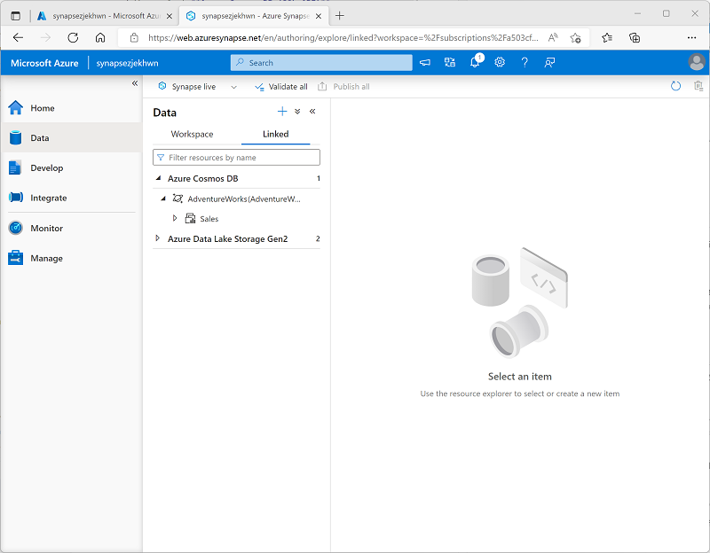

---
lab:
  title: Usar o Link do Azure Synapse para Azure Cosmos DB
  ilt-use: Lab
---

# Usar o Link do Azure Synapse para Azure Cosmos DB

O Link do Azure Synapse para Azure Cosmos DB é uma funcionalidade de HTAP *(processamento analítico transacional híbrido)* nativo de nuvem que permite executar análises quase em tempo real em dados operacionais armazenados no Azure Cosmos DB do Azure Synapse Analytics.

Este exercício deve levar aproximadamente **35** minutos para ser concluído.

## Antes de começar

É necessário ter uma [assinatura do Azure](https://azure.microsoft.com/free) com acesso de nível administrativo.

## Provisionar recursos do Azure

Para explorar o Link do Azure Synapse para o Azure Cosmos DB, você precisará de um workspace do Azure Synapse Analytics e uma conta do Azure Cosmos DB. Neste exercício, você usará uma combinação de um script do PowerShell e um modelo ARM para provisionar esses recursos em sua assinatura do Azure.

1. Entre no [portal do Azure](https://portal.azure.com) em `https://portal.azure.com`.
2. Use o botão **[\>_]** à direita da barra de pesquisa na parte superior da página para criar um Cloud Shell no portal do Azure, selecionando um ambiente ***PowerShell*** e criando armazenamento caso solicitado. O Cloud Shell fornece uma interface de linha de comando em um painel na parte inferior do portal do Azure, conforme mostrado aqui:

    

    > **Observação**: se você tiver criado anteriormente um could shell que usa um ambiente *Bash* , use o menu suspenso no canto superior esquerdo do painel do cloud shell para alterá-lo para ***PowerShell***.

3. Observe que você pode redimensionar o Cloud Shell arrastando a barra do separador na parte superior do painel ou usando os ícones **&#8212;** , **&#9723;** e **X** no canto superior direito do painel para minimizar, maximizar e fechar o painel. Para obter mais informações de como usar o Azure Cloud Shell, confira a [documentação do Azure Cloud Shell](https://docs.microsoft.com/azure/cloud-shell/overview).

4. No painel do PowerShell, insira os seguintes comandos para clonar esse repositório:

    ```
    rm -r dp-203 -f
    git clone https://github.com/MicrosoftLearning/dp-203-azure-data-engineer dp-203
    ```

5. Depois que o repositório tiver sido clonado, digite os seguintes comandos para alterar para a pasta deste exercício e execute o script **setup.ps1** que ele contém:

    ```
    cd dp-203/Allfiles/labs/14
    ./setup.ps1
    ```

6. Se solicitado, escolha qual assinatura você deseja usar (isso só acontecerá se você tiver acesso a várias assinaturas do Azure).
7. Quando solicitado, insira uma senha adequada a ser definida para seu pool de SQL do Azure Synapse.

    > **Observação**: Memorize a senha.

8. Aguarde a conclusão do script - isso normalmente leva cerca de 10 minutos, mas em alguns casos pode levar mais tempo. Enquanto espera, revise o artigo [O que é o Link do Azure Synapse para o Azure Cosmos DB?](https://docs.microsoft.com/azure/cosmos-db/synapse-link) na documentação do Azure Synapse Analytics.

## Configurar o Link do Synapse no Azure Cosmos DB

Antes de usar o Link do Synapse para o Azure Cosmos DB, você deve habilitá-lo em sua conta do Azure Cosmos DB e configurar um contêiner como um repositório analítico.

### Habilitar o recurso do Link do Synapse na sua conta do Cosmos DB

1. No [portal do Azure](https://portal.azure.com), navegue até o grupo de recursos **dp203-*xxxxxxx*** que foi criado pelo script de instalação e identifique sua conta do Cosmos DB **cosmos*xxxxxxxx***.

    > **Observação**: Em alguns casos, o script pode ter tentado criar contas do Cosmos DB em várias regiões, portanto, pode haver uma ou mais contas em um estado de *exclusão*. A conta ativa deve ser aquela com o maior número no final do nome - por exemplo **cosmos*xxxxxxx*3**.

2. Abra sua conta do Azure Cosmos DB e selecione a página **Data Explorer** no lado esquerdo de sua folha.

    *Se uma caixa de diálogo **Bem-vindo** for exibida, feche-a*

3. Na parte superior da página **Data Explorer**, use o botão **Habilitar o Link do Azure Synapse** para habilitar o Link do Synapse.

    

4. No lado esquerdo da página, na seção **Integrações**, selecione a página **Link do Azure Sinapse** e verifique se o status da conta está *Habilitado*.

### Criar um contêiner de repositório analítico

1. Retorne à página do **Data Explorer** e use o botão **novo Contêiner** (ou bloco) para criar um novo contêiner com as seguintes configurações:
    - **ID do banco de dados**: *(Criar novo)* AdventureWorks
    - **Compartilhar taxa de transferência entre os contêineres**: <u>Não</u> selecionado
    - **ID do contêiner**: Vendas
    - **Chave da partição**: /customerid
    - **Taxa de transferência do contêiner (dimensionamento automático)**: dimensionamento automático
    - **Máximo de RU/s do Contêiner**: 4000
    - **Repositório analítico**: Ativado

    > **Observação**: neste cenário, **customerid** é usado como chave de partição, uma vez que ele costuma ser utilizado em muitas das consultas para recuperar informações de pedidos de vendas e clientes em um aplicativo hipotético, ele tem uma cardinalidade relativamente alta (número de valores exclusivos) e, portanto, permitirá que o contêiner seja dimensionado conforme o número de clientes e pedidos de vendas aumenta. Usar o dimensionamento automático e definir o valor máximo como 4000 RU/s é apropriado para um novo aplicativo com volumes de consulta inicialmente baixos. Um valor máximo de 4000 RU/s permitirá que o contêiner seja dimensionado automaticamente entre esse valor até 10% desse valor máximo (400 RU/s) quando não for necessário.

2. Depois que o contêiner tiver sido criado, na página **Data Explorer**, expanda o banco de dados **AdventureWorks** e sua pasta **Sales** e selecione a pasta **Items**.

    

3. Use o botão **Novo Item** para criar um novo item de cliente com base no seguinte JSON. Em seguida, salve o novo item (alguns campos de metadados adicionais serão adicionados quando você salvar o item).

    ```json
    {
        "id": "SO43701",
        "orderdate": "2019-07-01",
        "customerid": 123,
        "customerdetails": {
            "customername": "Christy Zhu",
            "customeremail": "christy12@adventure-works.com"
        },
        "product": "Mountain-100 Silver, 44",
        "quantity": 1,
        "price": 3399.99
    }
    ```

4. Adicione um segundo item com o seguinte JSON:

    ```json
    {
        "id": "SO43704",
        "orderdate": "2019-07-01",
        "customerid": 124,
        "customerdetails": {
            "customername": "Julio Ruiz",
            "customeremail": "julio1@adventure-works.com"
        },
        "product": "Mountain-100 Black, 48",
        "quantity": 1,
        "price": 3374.99
    }
    ```

5. Adicione um terceiro item com o seguinte JSON:

    ```json
    {
        "id": "SO43707",
        "orderdate": "2019-07-02",
        "customerid": 125,
        "customerdetails": {
            "customername": "Emma Brown",
            "customeremail": "emma3@adventure-works.com"
        },
        "product": "Road-150 Red, 48",
        "quantity": 1,
        "price": 3578.27
    }
    ```

> **Observação**: Na realidade, o repositório analítico conteria um volume muito maior de dados, gravados no repositório por um aplicativo. Esses poucos itens serão suficientes para demonstrar o princípio neste exercício.

## Configurar o Link do Synapse no Azure Synapse Analytics

Agora que você preparou sua conta do Azure Cosmos DB, pode configurar o link do Azure Synapse para o Azure Cosmos DB em seu workspace do Azure Synapse Analytics.

1. No portal do Azure, feche a folha da sua conta do Cosmos DB se ela ainda estiver aberta e retorne ao grupo de recursos **dp203-*xxxxxxx***.
2. Abra o workspace do Synapse **synapse*xxxxxxx*** e na página **Visão geral**, no cartão **Open Synapse Studio**, selecione **Abrir** para abrir o Synapse Studio em uma nova guia do navegador, fazendo login se solicitado.
3. No lado esquerdo do Synapse Studio, use o ícone **&rsaquo;&rsaquo;** para expandir o menu, o que revela as diferentes páginas do Synapse Studio.
4. Na página **Dados**, exiba a guia **Vinculado**. Seu espaço de trabalho já deve incluir um link para sua conta de armazenamento do Azure Data Lake Storage Gen2, mas nenhum link para sua conta do Cosmos DB.
5. No menu **+**, selecione **Conectar a dados externos** e, em seguida, selecione **Azure Cosmos DB para NoSQL**.

    

6. Continue e crie uma nova conexão do Cosmos DB com as seguintes configurações:
    - **Nome**: AdventureWorks
    - **Descrição**: banco de dados do AdventureWorks Cosmos DB
    - **Conectar por meio de runtime de integração**: AutoResolveIntegrationRuntime
    - **Tipo de autenticação**: Chave de conta
    - **Cadeia de conexão**: *selecionado*
    - **Método de seleção de conta**: Da assinatura
    - **Assinatura do Azure**: *selecione a sua assinatura do Azure*
    - **Nome da conta do Azure Cosmos DB**: *selecione sua conta **cosmosxxxxxxx***
    - **Nome do banco de dados**: AdventureWorks
7. Depois de criar a conexão, use o botão **↻** no canto superior direito da página **Dados** para atualizar o modo de exibição até que uma categoria do **Azure Cosmos DB** seja listada no painel **Vinculado**.
8. Expanda a categoria do **Azure Cosmos DB** para ver a conexão **AdventureWorks** que você criou e o contêiner **Sales** que ela contém.

    

## Consultar o Azure Cosmos DB pelo Azure Synapse Analytics

Agora você está pronto para consultar seu banco de dados do Cosmos DB pelo Azure Synapse Analytics.

### Consultar o Azure Cosmos DB pelo pool do Spark

1. No painel **Dados**, selecione o contêiner **Sales** e o menu **...**, selecione **Novo Notebook** > **Carregar para DataFrame**.
2. Na nova guia **Notebook 1** que se abrir, na lista **Anexar a**, selecione seu pool do Spark (**spark*xxxxxxx***). Em seguida, use o botão **▷ Executar tudo** para executar todas as células do notebook (atualmente há apenas uma!).

    Como esta é a primeira vez que você executa qualquer código Spark nesta sessão, o pool do Spark precisa ser iniciado. Isso significa que a primeira execução na sessão pode levar alguns minutos. As execuções seguintes serão mais rápidas.

3. Enquanto aguarda a inicialização da sessão do Spark, revise o código gerado (você pode usar o botão **Propriedades**, que se parece com **<sub>*</sub>**, na extremidade direita da barra de ferramentas para fechar o painel **Propriedades** para que você possa ver o código com mais clareza). O código deve ser semelhante a:

    ```python
    # Read from Cosmos DB analytical store into a Spark DataFrame and display 10 rows from the DataFrame
    # To select a preferred list of regions in a multi-region Cosmos DB account, add .option("spark.cosmos.preferredRegions", "<Region1>,<Region2>")

    df = spark.read\
        .format("cosmos.olap")\
        .option("spark.synapse.linkedService", "AdventureWorks")\
        .option("spark.cosmos.container", "Sales")\
        .load()

    display(df.limit(10))
    ```

4. Quando o código terminar de ser executado e, em seguida, revise a saída abaixo da célula no notebook. Os resultados devem incluir três registros; um para cada um dos itens adicionados ao banco de dados do Cosmos DB. Cada registro inclui os campos inseridos quando você criou os itens, bem como alguns dos campos de metadados que foram gerados automaticamente.
5. Nos resultados da célula anterior, use o ícone **+ Código** para adicionar uma nova célula ao notebook e insira o código a seguir nele:

    ```python
    customer_df = df.select("customerid", "customerdetails")
    display(customer_df)
    ```

6. Use o ícone **▷** à esquerda da célula para executá-lo e exibir os resultados, que devem ser semelhantes a este:

    | customerid | customerdetails |
    | -- | -- |
    | 124 | "{"customername": "Julio Ruiz","customeremail": "julio1@adventure-works.com"}" |
    | 125 | "{"customername": "Emma Brown","customeremail": "emma3@adventure-works.com"}" |
    | 123 | "{"customername": "Christy Zhu","customeremail": "christy12@adventure-works.com"}" |

    Essa consulta criou um novo dataframe contendo apenas as colunas **customerid** e **customerdetails**. Observe que a coluna **customerdetails** contém a estrutura JSON para os dados aninhados no item de origem. Na tabela de resultados exibida, você pode usar o ícone **&#9658;** ao lado do valor JSON para expandi-lo e ver os campos individuais que ele contém.

7. Adicione outra nova célula de código e insira o seguinte código:

    ```python
    customerdetails_df = df.select("customerid", "customerdetails.*")
    display(customerdetails_df)
    ```

8. Execute a célula e revise os resultados, que devem incluir o **customername** e o **customeremail** do valor **customerdetails** como colunas:

    | customerid | customername | customeremail |
    | -- | -- | -- |
    | 124 | Julio Ruiz |julio1@adventure-works.com |
    | 125 | Emma Brown |emma3@adventure-works.com |
    | 123 | Christy Zhu | christy12@adventure-works.com |

    O Spark permite que você execute códigos de manipulação de dados complexos para reestruturar e explorar os dados do Cosmos DB. Nesse caso, a linguagem PySpark permite que você navegue na hierarquia de propriedades JSON para recuperar os campos filho do campo **customerdetails**.

9. Adicione outra nova célula de código e insira o seguinte código:

    ```sql
    %%sql

    -- Create a logical database in the Spark metastore
    CREATE DATABASE salesdb;

    USE salesdb;

    -- Create a table from the Cosmos DB container
    CREATE TABLE salesorders using cosmos.olap options (
        spark.synapse.linkedService 'AdventureWorks',
        spark.cosmos.container 'Sales'
    );

    -- Query the table
    SELECT *
    FROM salesorders;
    ```

10. Execute a nova célula para criar um novo banco de dados contendo uma tabela que inclua dados do repositório analítico do Cosmos DB.
11. Adicione outra nova célula de código e, em seguida, insira e execute o seguinte código:

    ```sql
    %%sql

    SELECT id, orderdate, customerdetails.customername, product
    FROM salesorders
    ORDER BY id;
    ```

    Os resultados dessa consulta devem ser semelhantes a este:

    | ID | orderdate | customername | produto |
    | -- | -- | -- | -- |
    | SO43701 | 2019-07-01 | Christy Zhu | Mountain-100 Silver, 44 |
    | SO43704 | 2019-07-01 | Julio Ruiz |Mountain-100 Black, 48 |
    | SO43707 | 2019-07-02 | Emma Brown |Road-150 Red, 48 |

    Observe que, ao usar o Spark SQL, você pode recuperar propriedades nomeadas de uma estrutura JSON como colunas.

12. Mantenha a guia **Notebook 1** aberta – você retornará a ela mais tarde.

### Consultar o Azure Cosmos DB a partir de pools de SQL sem servidor

1. No painel **Dados**, selecione o contêiner **Vendas** e, no menu **...**, selecione **Novo script SQL** > **Selecionar 100 primeiras linhas.**.
2. No painel **Script SQL 1** que será aberto, oculte o painel **Propriedades** e veja o código que foi gerado, que deve ser semelhante a este:

    ```sql
    IF (NOT EXISTS(SELECT * FROM sys.credentials WHERE name = 'cosmosxxxxxxxx'))
    THROW 50000, 'As a prerequisite, create a credential with Azure Cosmos DB key in SECRET option:
    CREATE CREDENTIAL [cosmosxxxxxxxx]
    WITH IDENTITY = ''SHARED ACCESS SIGNATURE'', SECRET = ''<Enter your Azure Cosmos DB key here>''', 0
    GO

    SELECT TOP 100 *
    FROM OPENROWSET(PROVIDER = 'CosmosDB',
                    CONNECTION = 'Account=cosmosxxxxxxxx;Database=AdventureWorks',
                    OBJECT = 'Sales',
                    SERVER_CREDENTIAL = 'cosmosxxxxxxxx'
    ) AS [Sales]
    ```

    O pool de SQL requer uma credencial para uso no acesso ao Cosmos DB, que é baseada em uma chave de autorização para sua conta do Cosmos DB. O script inclui uma instrução `IF (NOT EXISTS(...` inicial que verifica essa credencial e lança um erro se ela não existir.

3. Substitua a instrução `IF (NOT EXISTS(...` no script pelo código a seguir para criar uma credencial, substituindo *cosmosxxxxxxxx* pelo nome da sua conta do Cosmos DB:

    ```sql
    CREATE CREDENTIAL [cosmosxxxxxxxx]
    WITH IDENTITY = 'SHARED ACCESS SIGNATURE',
    SECRET = '<Enter your Azure Cosmos DB key here>'
    GO
    ```

    O script inteiro agora deve ser semelhante a isso:

    ```sql
    CREATE CREDENTIAL [cosmosxxxxxxxx]
    WITH IDENTITY = 'SHARED ACCESS SIGNATURE',
    SECRET = '<Enter your Azure Cosmos DB key here>'
    GO

    SELECT TOP 100 *
    FROM OPENROWSET(PROVIDER = 'CosmosDB',
                    CONNECTION = 'Account=cosmosxxxxxxxx;Database=AdventureWorks',
                    OBJECT = 'Sales',
                    SERVER_CREDENTIAL = 'cosmosxxxxxxxx'
    ) AS [Sales]
    ```

4. Alterne para a guia do navegador que contém o portal do Azure (ou abra uma nova guia e entre no portal do Azure em [https://portal.azure.com](https://portal.azure.com)). Em seguida, no grupo de recursos **dp203-*xxxxxxx***, abra sua conta do Azure Cosmos DB **cosmos*xxxxxxxx***.
5. No painel à esquerda, na seção **Configurações**, selecione a página **Chaves**. Em seguida, copie o valor da **Chave primária** para a área de transferência.
6. Alterne de volta para a guia do navegador que contém o script SQL no Azure Synapse Studio e cole a chave no código, substituindo o espaço reservado ***\<Enter your Azure Cosmos DB key here\>*** para que o script fique semelhante a este:

    ```sql
    CREATE CREDENTIAL [cosmosxxxxxxxx]
    WITH IDENTITY = 'SHARED ACCESS SIGNATURE',
    SECRET = '1a2b3c....................................=='
    GO

    SELECT TOP 100 *
    FROM OPENROWSET(PROVIDER = 'CosmosDB',
                    CONNECTION = 'Account=cosmosxxxxxxxx;Database=AdventureWorks',
                    OBJECT = 'Sales',
                    SERVER_CREDENTIAL = 'cosmosxxxxxxxx'
    ) AS [Sales]
    ```

7. Use o botão **&#9655; Executar** para executar o script e revise os resultados, que devem incluir três registros, um para cada um dos itens adicionados ao banco de dados do Cosmos DB.

    Agora que você criou a credencial, pode usá-la em qualquer consulta na fonte de dados do Cosmos DB.

8. Substitua todo o código no script (as instruções CREATE CREDENTIAL e SELECT) pelo seguinte código (substituindo *cosmosxxxxxxxx* pelo nome da sua conta do Azure Cosmos DB):

    ```sql
    SELECT *
    FROM OPENROWSET(PROVIDER = 'CosmosDB',
                    CONNECTION = 'Account=cosmosxxxxxxxx;Database=AdventureWorks',
                    OBJECT = 'Sales',
                    SERVER_CREDENTIAL = 'cosmosxxxxxxxx'
    )
    WITH (
        OrderID VARCHAR(10) '$.id',
        OrderDate VARCHAR(10) '$.orderdate',
        CustomerID INTEGER '$.customerid',
        CustomerName VARCHAR(40) '$.customerdetails.customername',
        CustomerEmail VARCHAR(30) '$.customerdetails.customeremail',
        Product VARCHAR(30) '$.product',
        Quantity INTEGER '$.quantity',
        Price FLOAT '$.price'
    )
    AS sales
    ORDER BY OrderID;
    ```

9. Execute o script e revise os resultados, que devem corresponder ao esquema definido na cláusula `WITH`:

    | OrderID | OrderDate | CustomerID | CustomerName | CustomerEmail | Product | Quantidade | Preço |
    | -- | -- | -- | -- | -- | -- | -- | -- |
    | SO43701 | 2019-07-01 | 123 | Christy Zhu | christy12@adventure-works.com | Mountain-100 Silver, 44 | 1 | 3399.99 |
    | SO43704 | 2019-07-01 | 124 | Julio Ruiz | julio1@adventure-works.com | Mountain-100 Black, 48 | 1 | 3374.99 |
    | SO43707 | 2019-07-02 | 125 | Emma Brown | emma3@adventure-works.com | Road-150 Red, 48 | 1 | 3578.27 |

10. Mantenha a guia **script SQL 1** aberta – você retornará a ela mais tarde.

### Verifique se as modificações de dados no Cosmos DB estão refletidas no Synapse 

1. Deixando a guia do navegador que contém o Synapse Studio aberta, volte para a guia que contém o portal do Azure, que deve estar aberta na página **Chaves** da sua conta do Cosmos DB.
2. Na página **Explorador de Dados**, expanda o banco de dados **AdventureWorks** e sua pasta **Vendas** e, em seguida, selecione a pasta **Itens**.
3. Use o botão **Novo Item** para criar um novo item de cliente com base no seguinte JSON. Em seguida, salve o novo item (alguns campos de metadados adicionais serão adicionados quando você salvar o item).

    ```json
    {
        "id": "SO43708",
        "orderdate": "2019-07-02",
        "customerid": 126,
        "customerdetails": {
            "customername": "Samir Nadoy",
            "customeremail": "samir1@adventure-works.com"
        },
        "product": "Road-150 Black, 48",
        "quantity": 1,
        "price": 3578.27
    }
    ```

4. Retorne à guia Synapse Studio e, na guia **Script SQL 1** , execute novamente a consulta. Inicialmente, os mesmos resultados de antes podem ser exibidos, mas aguarde um minuto ou mais e, em seguida, execute novamente a consulta até que os resultados incluam a venda para Samir Nadoy em 02/07/2019.
5. Volte para a guia **Notebook 1** e execute novamente a última célula no notebook do Spark para verificar se a venda para Samir Nadoy agora está incluída nos resultados da consulta.

## Excluir recursos do Azure

Se você terminou de explorar Azure Synapse Analytics, exclua os recursos que criou para evitar custos desnecessários do Azure.

1. Feche a guia do navegador do Synapse Studio e retorne ao portal do Azure.
2. No portal do Azure, na **Página Inicial**, selecione **Grupos de recursos**.
3. Selecione o grupo de recursos **dp203-*xxxxxxx*** para o workspace do seu Synapse Analytics (não o grupo de recursos gerenciado) e verifique se ele contém o workspace do Synapse, a conta de armazenamento e o pool do Spark para seu workspace, bem como sua conta do Azure Cosmos DB.
4. Na parte superior da página de **Visão Geral** do grupo de recursos, selecione **Excluir o grupo de recursos**.
5. Digite o nome do grupo de recursos **dp203-*xxxxxxx*** para confirmar que deseja excluí-lo e selecione **Excluir**.

    Após alguns minutos, seu grupo de recursos do workspace do Azure Synapse e grupo de recursos do workspace gerenciado associado a ele serão excluídos.
