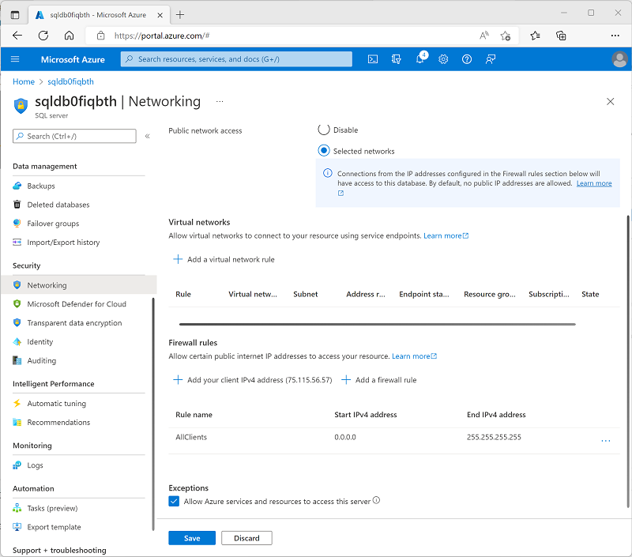

---
lab:
  title: Usar o Link do Azure Synapse para SQL
  ilt-use: Suggested demo
---

# Usar o Link do Azure Synapse para SQL

O Link do Azure Synapse para SQL permite sincronizar automaticamente um banco de dados transacional no SQL Server ou no Banco de Dados SQL do Azure com um pool SQL dedicado no Azure Synapse Analytics. Essa sincronização permite que você execute cargas de trabalho analíticas de baixa latência no Synapse Analytics sem incorrer em sobrecarga de consulta no banco de dados operacional de origem.

Este exercício deve levar aproximadamente **35** minutos para ser concluído.

## Antes de começar

É necessário ter uma [assinatura do Azure](https://azure.microsoft.com/free) com acesso de nível administrativo.

## Provisionar recursos do Azure

Neste exercício, você sincronizará dados de um recurso do Banco de Dados SQL do Azure com um workspace do Azure Synapse Analytics. Você começará usando um script para provisionar esses recursos em sua assinatura do Azure.

1. Entre no [portal do Azure](https://portal.azure.com) em `https://portal.azure.com`.
2. Use o botão **[\>_]** à direita da barra de pesquisa na parte superior da página para criar um Cloud Shell no portal do Azure, selecionando um ambiente ***PowerShell*** e criando armazenamento caso solicitado. O Cloud Shell fornece uma interface de linha de comando em um painel na parte inferior do portal do Azure, conforme mostrado aqui:

    

    > **Observação**: se você tiver criado anteriormente um cloud shell que usa um ambiente *Bash*, use o menu suspenso no canto superior esquerdo do painel do cloud shell para alterá-lo para ***PowerShell***.

3. Observe que você pode redimensionar o Cloud Shell arrastando a barra do separador na parte superior do painel ou usando os ícones **&#8212;** , **&#9723;** e **X** no canto superior direito do painel para minimizar, maximizar e fechar o painel. Para obter mais informações de como usar o Azure Cloud Shell, confira a [documentação do Azure Cloud Shell](https://docs.microsoft.com/azure/cloud-shell/overview).

4. No painel do PowerShell, insira os seguintes comandos para clonar esse repositório:

    ```
    rm -r dp-203 -f
    git clone https://github.com/MicrosoftLearning/dp-203-azure-data-engineer dp-203
    ```

5. Depois que o repositório tiver sido clonado, digite os seguintes comandos para alterar para a pasta deste exercício e execute o script **setup.ps1** que ele contém:

    ```
    cd dp-203/Allfiles/labs/15
    ./setup.ps1
    ```

6. Se solicitado, escolha qual assinatura você deseja usar (isso só acontecerá se você tiver acesso a várias assinaturas do Azure).
7. Quando solicitado, insira uma senha adequada para seu Banco de Dados SQL do Azure.

    > **Observação**: lembre-se dessa senha.

8. Aguarde a conclusão do script – isso normalmente leva cerca de 15 minutos, mas em alguns casos pode levar mais tempo. Enquanto espera, revise o artigo [O que é o Link do Azure Synapse para SQL?](https://docs.microsoft.com/azure/synapse-analytics/synapse-link/sql-synapse-link-overview) na documentação do Azure Synapse Analytics.

## Configurar o Banco de Dados SQL do Azure

Antes de configurar o Link do Azure Synapse para seu Banco de Dados SQL do Azure, você deve garantir que as definições de configuração necessárias tenham sido aplicadas no servidor do Banco de Dados SQL do Azure.

1. No [portal do Azure](https://portal.azure.com), navegue até o grupo de recursos **dp203-*xxxxxxx*** que foi criado pelo script de instalação e selecione seu SQL server **sqldb*xxxxxxxx***.

    > **Observação**: tenha cuidado para não misturar o recurso do Azure SQL Server **sqldb*xxxxxxxx***) e o pool de SQL dedicado do Azure Synapse Analytics (** sql*xxxxxxxx***).

2. Na página do recurso do SQL Server do Azure, no painel à esquerda, na seção **Segurança** (próxima à parte inferior), selecione **Identidade**. Em seguida, em **Identidade gerenciada atribuída ao sistema**, defina a opção **Status** como **Ativado**. Em seguida, use o ícone ** Salvar** para salvar sua alteração de configuração.

    

3. No menu esquerdo, na seção **Segurança**, selecione **Rede**. Em **regras de Firewall**, selecione a exceção **Permitir que serviços e recursos do Azure acessem este servidor**.

4. Use o botão **＋ Adicionar uma regra de firewall** para adicionar uma nova regra de firewall com as seguintes configurações:

    | Nome da regra | IP Inicial | IP Final |
    | -- | -- | -- |
    | AllClients | 0.0.0.0 | 255.255.255.255 |

    > **Observação**: Esta regra permite o acesso ao servidor a partir de qualquer computador ligado à Internet. Estamos habilitando isso para simplificar o exercício, mas em um cenário de produção, você deve restringir o acesso apenas a endereços de rede que precisam usar seus bancos de dados.

5. Para salvar as alterações de configuração, use o botão **Salvar**:

    

## Explorar o banco de dados transacional

Seu Azure SQL Server hospeda um banco de dados de exemplo chamado **AdventureWorksLT**. Esse banco de dados representa um banco de dados transacional usado para dados de aplicativos operacionais.

1. Na página **Visão geral** do seu Azure SQL Server, na parte inferior, selecione o banco de dados **AdventureWorksLT**:
2. Na página do banco de dados **AdventureWorksLT**, selecione a guia **Editor de consultas** e faça logon usando a autenticação do SQL Server com as seguintes credenciais:
    - **Login** SQLUser
    - **Senha**: *a senha especificada ao executar o script de instalação.*
3. Quando o editor de consultas for aberto, expanda o nó **Tabelas** e exiba a lista de tabelas no banco de dados. Observe que eles incluem tabelas em um esquema **SalesLT** (por exemplo, **SalesLT.Customer**).

## Configurar o Link do Azure Synapse

Agora você está pronto para configurar o Link do Azure Synapse para SQL em seu workspace do Synapse Analytics.

### Iniciar o pool de SQL dedicado

1. No portal do Azure, feche o editor de consultas do banco de dados SQL do Azure (descartando quaisquer alterações) e retorne à página do seu grupo de recursos **dp203-*xxxxxxx***.
2. Abra o workspace do Synapse **synapse*xxxxxxx*** e, em sua página **Visão geral**, no cartão **Open Synapse Studio**, selecione **Abrir** para abrir o Synapse Studio em uma nova guia do navegador, entrando se solicitado.
3. No lado esquerdo do Synapse Studio, use o ícone **&rsaquo;&rsaquo;** para expandir o menu, o que revela as diferentes páginas do Synapse Studio.
4. Na página **Gerenciar**, na guia **pools de SQL**, selecione a linha do pool de SQL dedicado **sql*xxxxxxx*** e use seu ícone **▷** para iniciá-lo, confirmando que você deseja retomá-lo quando solicitado.
5. Aguarde até que o pool de SQL seja retomado. Isso pode levar alguns minutos. Você pode usar o botão **↻ Atualizar** para verificar seu status periodicamente. O status será exibido como **Online** quando estiver pronto.

### Criar o esquema de destino

1. No Synapse Studio, na página **Dados**, na guia **Workspace**, expanda **banco de dados do SQL** e selecione seu banco de dados **sql*xxxxxxx***.
2. No menu **...** para o banco de dados **sql*xxxxxxx***, selecione **Novo script de SQL** > **Esvaziar script**.
3. No painel **Script de SQL 1**, insira o seguinte código SQL e use o botão **▷ Executar** para executá-lo.

    ```sql
    CREATE SCHEMA SalesLT;
    GO
    ```

4. Aguarde a consulta ser concluída. Esse código cria um esquema chamado **SalesLT** no banco de dados para seu pool de SQL dedicado, permitindo que você sincronize tabelas no esquema desse nome do banco de dados SQL do Azure.

### Criar uma conexão de link

1. No Synapse Studio, na página **Integrar**, no menu suspenso **＋**, selecione **Vincular conexão**. Em seguida, crie uma conexão vinculada com as seguintes configurações:
    - **Tipo de origem**: Banco de dados SQL do Azure
    - **Serviço vinculado de origem**: adicione um novo serviço vinculado com as seguintes configurações (uma nova guia será aberta):
        - **Nome**: SqlAdventureWorksLT
        - **Descrição**: Conexão com o banco de dados AdventureWorksLT
        - **Conectar por meio de runtime de integração**: AutoResolveIntegrationRuntime
        - **Versão**: Herdada
        - **Cadeia de Conexão**: Selecionado
        - **Da assinatura do Azure**: Selecionado
        - **Assinatura do Azure**: *Selecione sua assinatura do Azure*
        - **Nome do servidor**: *Selecione seu Azure SQL Server **sqldbxxxxxxx***
        - **Nome do banco de dados**: AdventureWorksLT
        - **Tipo de autenticação**: Autenticação do SQL
        - **Nome de usuário**: SQLUser
        - **Senha**: *a senha definida ao executar o script de instalação*

        *Use a opção **Testar Conectividade** para verificar se as configurações de conexão estão corretas antes de continuar. Em seguida, clique em **Criar**.*

    - **Tabelas de origem**: selecione as seguintes tabelas:
        - **SalesLT.Customer**
        - **SalesLT.Product**
        - **SalesLT.SalesOrderDetail**
        - **SalesLT.SalesOrderHeader**

        *Continue a definir as seguintes configurações:*

    > **Observação**: Algumas tabelas de destino exibem um erro devido ao uso de tipos de dados personalizados ou porque os dados da tabela de origem não são compatíveis com o tipo de estrutura padrão do *índice de columnstore clusterizado*.

    - **Pool de destino**: *selecione seu pool de SQL dedicado **sqlxxxxxxx***

        *Continue a definir as seguintes configurações:*

    - **Nome da conexão do link**: sql-adventureworkslt-conn
    - **Contagem de núcleos**: 4 (+ 4 núcleos de driver)

2. Na página **sql-adventureworkslt-conn** criada, exiba os mapeamentos de tabela que foram criados. Você pode usar o botão **Propriedades** (que se parece com **<sub>*</sub>**) para ocultar o painel **Propriedades** para facilitar a visualização de todos os itens. 

3. Modifique os tipos de estrutura nos mapeamentos de tabela da seguinte maneira:

    | Tabela de origem | Tabela de destino | Tipo de distribuição | Coluna de distribuição | Tipo de estrutura |
    |--|--|--|--|--|
    | SalesLT.Customer **→** | \[SalesLT] . \[Customer] | Round robin | - | Índice columnstore clusterizado |
    | SalesLT.Product **→** | \[SalesLT] . \[Product] | Round robin | - | Heap |
    | SalesLT.SalesOrderDetail **→** | \[SalesLT] . \[SalesOrderDetail] | Round robin | - | Índice columnstore clusterizado |
    | SalesLT.SalesOrderHeader **→** | \[SalesLT] . \[SalesOrderHeader] | Round robin | - | Heap |

4. Na parte superior da página **sql-adventureworkslt-conn** criada, use o botão **▷ Iniciar** para iniciar a sincronização. Quando solicitado, selecione **OK** para publicar e iniciar a conexão de link.
5. Depois de iniciar a conexão, na página **Monitor**, exiba a guia **Vincular conexões** e selecione a conexão **sql-adventureworkslt-conn**. Use o botão **↻ Atualizar** para atualizar o status periodicamente. Pode levar vários minutos para concluir o processo inicial de cópia de instantâneo e começar a replicar - depois disso, todas as alterações nas tabelas do banco de dados de origem serão automaticamente reproduzidas nas tabelas sincronizadas.

### Exibir os dados replicados

1. Depois que o status das tabelas for alterado para **Em execução**, selecione a página **Dados** e use o ícone **↻** na parte superior direita para atualizar a visualização.
2. Na guia **Workspace**, expanda os **bancos de dados de SQL**, seu banco de dados **sql*xxxxxxx*** e as pastas **Tabelas** para ver as tabelas replicadas.
3. No menu **...** para o banco de dados **sql*xxxxxxx***, selecione **Novo script de SQL** > **Esvaziar script**. Em seguida, na nova página de script, insira o seguinte código SQL:

    ```sql
    SELECT  oh.SalesOrderID, oh.OrderDate,
            p.ProductNumber, p.Color, p.Size,
            c.EmailAddress AS CustomerEmail,
            od.OrderQty, od.UnitPrice
    FROM SalesLT.SalesOrderHeader AS oh
    JOIN SalesLT.SalesOrderDetail AS od 
        ON oh.SalesOrderID = od.SalesOrderID
    JOIN  SalesLT.Product AS p 
        ON od.ProductID = p.ProductID
    JOIN SalesLT.Customer as c
        ON oh.CustomerID = c.CustomerID
    ORDER BY oh.SalesOrderID;
    ```

4. Use o botão **▷ Executar** para executar o script e exibir os resultados. A consulta é executada nas tabelas replicadas no pool de SQL dedicado e não no banco de dados de origem, permitindo que você execute consultas analíticas sem afetar os aplicativos de negócios.
5. Quando terminar, na página **Gerenciar**, pause o pool de SQL dedicado **sql*xxxxxxx***.

## Excluir recursos do Azure

Se você terminou de explorar Azure Synapse Analytics, exclua os recursos que criou para evitar custos desnecessários do Azure.

1. Feche a guia do navegador do Synapse Studio e retorne ao portal do Azure.
2. No portal do Azure, na **Página Inicial**, selecione **Grupos de recursos**.
3. Selecione o grupo de recursos **dp203-*xxxxxxx*** que foi criado pelo script de instalação no início deste exercício.
4. Na parte superior da página de **Visão Geral** do grupo de recursos, selecione **Excluir o grupo de recursos**.
5. Digite o nome do grupo de recursos **dp203-*xxxxxxx*** para confirmar que deseja excluí-lo e selecione **Excluir**.

    Depois de alguns minutos, o grupo de recursos e os recursos contidos nele serão excluídos.
