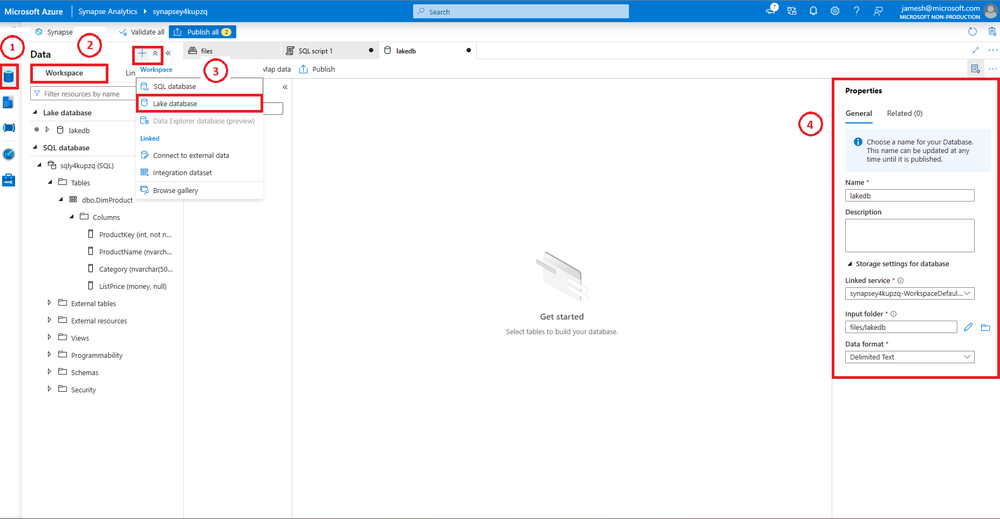
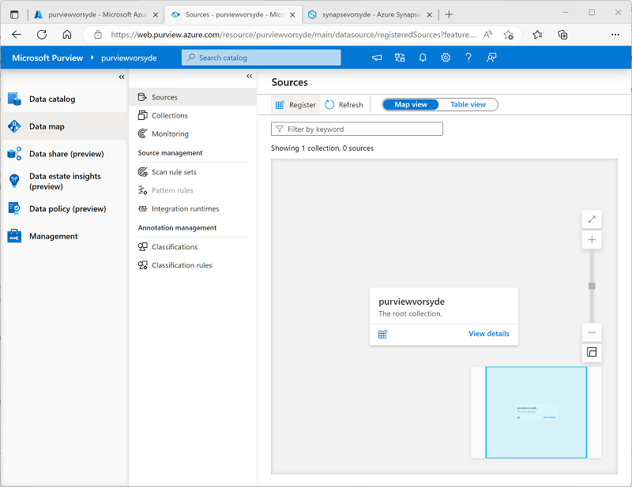
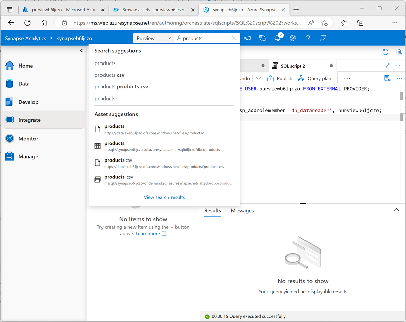

---
lab:
  title: Usar o Microsoft Purview com o Azure Synapse Analytics
  ilt-use: Lab
---

> **Importante**: o Microsoft Purview foi atualizado para restringir o número de contas do Microsoft Purview disponíveis por locatário do Azure. Consequentemente, esse laboratório não tem suporte em ambientes de locatário compartilhados, incluindo muitos ambientes de laboratório hospedados usados em cursos de treinamento ministrados por instrutor.

# Usar o Microsoft Purview com o Azure Synapse Analytics

O Microsoft Purview permite catalogar ativos de dados em todo o seu estado de dados e rastrear o fluxo de dados à medida que são transferidos de uma fonte de dados para outra - um elemento-chave de uma solução abrangente de governança de dados.

Este exercício levará aproximadamente **40** minutos para ser concluído.

## Antes de começar

Você precisará de uma [assinatura do Azure](https://azure.microsoft.com/free) na qual tenha privilégios de nível administrativo e acesso exclusivo ao locatário no qual a assinatura está definida.

## Provisionar recursos do Azure

Neste exercício, você usará o Microsoft Purview para rastrear ativos e linhagem de dados em um workspace do Azure Synapse Analytics. Você começará usando um script para provisionar esses recursos em sua assinatura do Azure.

1. Entre no [portal do Azure](https://portal.azure.com) em `https://portal.azure.com`.
2. Use o botão **[\>_]** à direita da barra de pesquisa na parte superior da página para criar um Cloud Shell no portal do Azure, selecionando um ambiente ***PowerShell*** e criando armazenamento caso solicitado. O Cloud Shell fornece uma interface de linha de comando em um painel na parte inferior do portal do Azure, conforme mostrado aqui:

    

    > **Observação**: se você tiver criado anteriormente um cloud shell que usa um ambiente *Bash*, use o menu suspenso no canto superior esquerdo do painel do cloud shell para alterá-lo para ***PowerShell***.

3. Observe que você pode redimensionar o Cloud Shell arrastando a barra do separador na parte superior do painel ou usando os ícones **&#8212;** , **&#9723;** e **X** no canto superior direito do painel para minimizar, maximizar e fechar o painel. Para obter mais informações de como usar o Azure Cloud Shell, confira a [documentação do Azure Cloud Shell](https://docs.microsoft.com/azure/cloud-shell/overview).

4. No painel do PowerShell, insira os seguintes comandos para clonar esse repositório:

    ```
    rm -r dp-203 -f
    git clone https://github.com/MicrosoftLearning/dp-203-azure-data-engineer dp-203
    ```

5. Depois que o repositório tiver sido clonado, digite os seguintes comandos para alterar para a pasta deste laboratório e execute o script **setup.ps1** que ele contém:

    ```
    cd dp-203/Allfiles/labs/22
    ./setup.ps1
    ```

6. Se solicitado, escolha qual assinatura você deseja usar (isso só acontecerá se você tiver acesso a várias assinaturas do Azure).
7. Quando solicitado, insira uma senha adequada para seu Banco de Dados SQL do Azure.

    > **Observação**: lembre-se dessa senha.

8. Aguarde a conclusão do script – isso normalmente leva cerca de 15 minutos, mas em alguns casos pode levar mais tempo. Enquanto você espera, revise o artigo [O que está disponível no portal de governança do Microsoft Purview?](https://docs.microsoft.com/azure/purview/overview) na documentação do Microsoft Purview.

> **Dica**: se, depois de executar o script de instalação, você decidir não concluir o laboratório, exclua o grupo de recursos **dp203-*xxxxxxx*** que foi criado em sua assinatura do Azure para evitar custos desnecessários do Azure.

## Criar um banco de dados Lake

Os bancos de dados Lake armazenam dados em um data lake no Azure Storage. Você pode usar os formatos Parquet, Delta ou CSV e outras configurações para otimizar o armazenamento. Todo banco de dados Lake usa um serviço vinculado para definir a pasta de dados raiz.

Os bancos de dados Lake são acessíveis no pool de SQL sem servidor Synapse SQL e no Apache Spark, permitindo que os usuários separem o armazenamento da computação. Os metadados do banco de dados Lake facilitam que diferentes mecanismos forneçam uma experiência integrada, e usem informações extras (por exemplo, relações) que não tinham suporte no data lake.

1. Para criar um banco de dados Lake, vamos primeiro abrir o synapsexxxxxxx do grupo de recursos apropriado e, em seguida, clique no link ***aberto*** no **Open Synapse Studio**. 
2. Em seguida, clicaremos na caixa de ferramentas com a chave inglesa, que também é a seção Gerenciar do workspace do Synapse Analytics e verificaremos se nosso pool Dedicado está em execução. A inicialização pode levar alguns minutos.
3. A partir daqui, vamos clicar no símbolo do banco de dados que se parece com um barril e tem um rótulo de dados.
4. Uma vez no painel Dados, clique no símbolo + à direita da palavra **Dados** e selecione ***Banco de dados Lake***
   
    

> **Observação**: você receberá um prompt dos **Termos de Uso do Modelo de Banco de Dados do Azure Synapse** que você deve ler e entender antes de clicar no botão **OK**.

5. Você observará no lado direito que há uma janela Propriedades.
   1. Digite **lakedb** no campo de nome.
   1. em **Pasta de entrada**, selecione a pasta e navegue até root/files/data e pressione **OK**.

>**Observação**: Você provavelmente verá um erro ao abrir a **pasta de Entrada**, basta clicar duas vezes na pasta raiz e trabalhar seu caminho até os dados antes de clicar em **OK** , se esse for o caso.

   1. À esquerda desta tela, você verá um pilar com o nome do seu **lakedb** com uma **+Tabela** abaixo dele, clique nele e selecione ***Do data lake***
   1. Em ***Nome da tabela externa***, digite: **Produtos**.
   1. Em ***Serviço vinculado***, selecione a opção padrão.
   1. Na ***pasta ou entrada de Arquivo***, clique na pasta do arquivo na extremidade direita e navegue até **raiz > arquivos > dados >** e selecione ***products.csv*** e clique em **OK**. Em seguida, clique em **Continuar**.

6. No painel **Nova tabela externa**, selecione a opção Primeira Linha para ***inferir nomes da coluna***. Em seguida, clique em **criar**.


7. Pressione **Publicar** na parte superior da janela de design da consulta.
8. Em **Dados**, verifique se você está na área do **Workspace** no lado esquerdo e expanda a seção **banco de dados Lake**, expanda **lakedb**, ***passe o mouse sobre*** o lado direto da tabela de **Produtos** e escolha as ***100 primeiras linhas***.


> **Observação**: Verfique se a opção **Conectar-se a** está listada como **Interno** e deixe o banco de dados **mestre** selecionado ou clique no botão Atualizar à direita e selecione o banco de dados **lakedb**. Como é usada uma convenção de nomenclatura de 3 partes [banco de dados]. [esquema]. [tabela] ambos vão funcionar.


9. Pressione o botão **Executar** para exibir os dados na tabela do banco de dados lake.

## Adicionar Serviço do Microsoft Purview à Conta

O Microsoft Purview é um portfólio detalhado de produtos que abrangem governança de dados, proteção de informações, gerenciamento de riscos e soluções de conformidade. Ele ajuda você a governar, proteger e gerenciar todo o seu estado de dados em seus dados locais, em várias nuvens e em software como serviço (SaaS)

Para configurá-lo, primeiro retornaremos ao nosso grupo de recursos principal, que será chamado dp203-xxxxxxx com base no número aleatório que lhe foi atribuído. Quando estiver no **grupo de recursos**, clique no botão ***+ Criar*** para adicionar um novo serviço.

1. Selecione o **serviço Microsoft Purview** e clique no botão **Criar**.
2. Durante o processo de criação, como você iniciou no grupo de recursos apropriado, ele já deve estar selecionado. Em seguida, daremos um nome ao **Purview** usando seu número atribuído aleatoriamente. Em seguida, selecione a melhor região para a sua instância.

   

3. Clique no botão **Revisar e Criar** e aguarde a ***Validação*** antes de avançar.

   

4. Depois que a validação for aprovada, pressione o botão **Criar**.

> **Observação**: Talvez seja necessário tentar algumas regiões para poder passar na validação com o Purview.

## Catalogar ativos de dados do Azure Synapse Analytics no Microsoft Purview

Com o Microsoft Purview, você pode catalogar ativos de dados em todo o seu estado de dados, incluindo fontes de dados em um Workspace do Azure Synapse. O workspace que você acabou de implantar inclui um data lake (em uma conta do Azure Data Lake Storage Gen2), um banco de dados sem servidor e um data warehouse em um pool de SQL dedicado.

### Configurar o acesso com base em função para o Microsoft Purview

O Microsoft Purview está configurado para usar uma identidade gerenciada. Para catalogar ativos de dados, essa conta de identidade gerenciada deve ter acesso ao workspace do Azure Synapse Analytics e à conta de armazenamento para seu repositório data lake.

1. No [portal do Azure](https://portal.azure.com), navegue até o grupo de recursos **dp203-*xxxxxxx*** que foi criado pelo script de instalação e exiba os recursos que ele criou. Estão incluídos:
    - Uma conta de armazenamento com um nome semelhante a **datalake*xxxxxxx***.
    - Uma conta do Microsoft Purview com um nome semelhante a **purview*xxxxxxx***.
    - Um pool de SQL dedicado com um nome semelhante a **sql*xxxxxxx***.
    - Um workspace do Synapse com um nome semelhante a **synapse*xxxxxxx***.
2. Abra a conta de armazenamento **datalake*xxxxxxx*** e, em sua página **Controle de Acesso (IAM)**, visualize a guia **Atribuições de Funções**, conforme mostrado aqui:

    

3. No menu do botão **+ Adicionar**, selecione **Adicionar atribuição de função**. 
4. Na página **Adicionar atribuição de função**, na guia **Função**, pesquise "blob de armazenamento" e selecione **Leitor de Dados do Blob de Armazenamento**. Em seguida, selecione **Avançar** para seguir para a guia **Membros**:

    

5. Na guia **Membros**, na lista **Atribuir acesso a**, selecione **Identidade gerenciada**; e em **Membros**, selecione **Selecionar membros**.
6. No painel **Selecionar identidades gerenciadas**, na lista **Identidade gerenciada**, selecione **conta do Microsoft Purview (*n*)** e selecione a sua conta do Microsoft Purview, que deve ter um nome semelhante a **purview*xxxxxxx***; e use o botão **Selecionar** para adicionar essa conta à atribuição de função:

    

7. Use o botão **Revisar + Atribuir** para concluir a atribuição de função, o que torna a conta **purview*xxxxxxx*** usada pela identidade gerenciada para seu recurso Microsoft Purview um membro da função **Leitor de Dados de Blob de Armazenamento** para sua conta de armazenamento.
8. No portal do Azure, retorne ao grupo de recursos **dp203-*xxxxxxx*** e abra o workspace **synapse*xxxxxxx*** do Synapse Analytics. Em seguida, em sua página de **Controle de Acesso (IAM),** adicione uma atribuição de função para tornar a conta de identidade gerenciada **purview*xxxxxxx*** um membro da função **Leitor** no workspace.

### Configurar as permissões do banco de dados para o Microsoft Purview

Seu workspace do Azure Synapse Analytics inclui bancos de dados em pools de SQL *sem servidor* e *dedicados* , aos quais a identidade gerenciada usada pelo Microsoft Purview requer acesso.

1. No portal do Azure, na página do seu workspace do Synapse Analytics, exiba a guia **Visão Geral**. Em seguida, no bloco **Abrir Synapse Studio**, use o link para abrir o Azure Synapse Studio em uma nova guia do navegador - entrando se solicitado.

    >**Dica**: como alternativa, você pode abrir o Azure Synapse Studio navegando diretamente para https://web.azuresynapse.net em uma nova guia do navegador.

2. No lado esquerdo do Synapse Studio, use o ícone **&rsaquo;&rsaquo;** para expandir o menu, o que revela as diferentes páginas do Synapse Studio.
3. Na página **Gerenciar**, na guia **pools de SQL**, selecione a linha do pool de SQL dedicado **sql*xxxxxxx*** e use seu ícone **▷** para iniciá-lo, confirmando que você deseja retomá-lo quando solicitado.

    

4. Aguarde até que o pool de SQL seja retomado. Isso pode levar alguns minutos. Você pode usar o botão **↻ Atualizar** para verificar seu status periodicamente. O status será exibido como **Online** quando estiver pronto.
5. No Azure Synapse Studio, exiba a página **Dados** e, na guia **Workspace**, expanda o **banco de dados SQL** para ver os bancos de dados em seu workspace. Devem estar inclusos:
    - Um banco de dados de pool de SQL sem servidor chamado **lakedb**.
    - Um banco de dados de pool de SQL dedicado chamado **sql*xxxxxxx***.

    

6. Selecione o banco de dados **lakedb** e, em seguida, no menu **...**, selecione **Novo script de SQL** > **Esvaziar script** para abrir um novo painel **Script de SQL 1**. Você pode usar o botão **Propriedades** (que se parece com **<sub>*</sub>**) na extremidade direita da barra de ferramentas para ocultar o painel **Propriedades** e ver o painel do script mais facilmente.
7. No painel **script de SQL 1**, insira o seguinte código SQL, substituindo todas as instâncias de ***purviewxxxxxxx*** pelo nome da identidade gerenciada para sua conta do Microsoft Purview:

    ```sql
    CREATE LOGIN purviewxxxxxxx FROM EXTERNAL PROVIDER;
    GO

    CREATE USER purviewxxxxxxx FOR LOGIN purviewxxxxxxx;
    GO

    ALTER ROLE db_datareader ADD MEMBER purviewxxxxxxx;
    GO
    ```

8. Use o botão **▷ Executar** para executar o script, que cria um logon no pool sem servidor e um usuário no usuário **lakedb** para a identidade gerenciada usada pelo Microsoft Purview e adiciona o usuário à função **db_datareader** no banco de dados **lakedb**.
9. Crie um novo script vazio para o banco de dados do pool de SQL decicado **sql*xxxxxxx*** e use-o para executar o seguinte código SQL (substituindo ***purviewxxxxxxx*** pelo nome de identidade gerenciada para sua conta do Microsoft Purview), que cria um usuário no pool de SQL dedicado para a identidade gerenciada usada pelo Microsoft Purview e o adiciona à função **db_datareader** no banco de dados **sql*xxxxxxx***.

    ```sql
    CREATE USER purviewxxxxxxx FROM EXTERNAL PROVIDER;
    GO

    EXEC sp_addrolemember 'db_datareader', purviewxxxxxxx;
    GO
    ```

### Registre as fontes no catálogo do Microsoft Purview

Agora que você configurou o acesso necessário para que o Microsoft Purview verifique as fontes de dados usadas pelo seu workspace do Azure Synapse Analytics, você pode registrá-las em seu catálogo do Microsoft Purview.

1. Volte para a guia do navegador que contém o portal do Azure e exiba a página do grupo de recursos **dp203-*xxxxxxx***.
2. Abra a conta do Microsoft Purview **purview*xxxxxxx*** e, na página **Visão Geral**, use o link para abrir o **Portal de Governança do Microsoft Purview** em uma nova guia - entrando, se solicitado.

    >**Dica**: Como alternativa, você pode navegar diretamente para https://web.purview.azure.com uma nova guia do navegador.

3. No lado esquerdo do Portal de Governança do Azure Purview, use o ícone **&rsaquo;&rsaquo;** para expandir o menu - isso revela as diferentes páginas dentro do portal.
4. Na página **Mapa de dados**, na subpágina **Códigos-fonte**, selecione **Registrar**:

    

5. Na guia **Registrar fontes** exibida, selecione **Azure Synapse Analytics** e continue a registrar uma fonte com as seguintes configurações:
    - **Nome**: Synapse_data
    - **Assinatura do Azure**: *Selecione sua assinatura do Azure*
    - **Nome do workspace**: *Selecione seu workspace **synapsexxxxxxx***
    - **Ponto de extremidade SQL dedicado**: sql*xxxxxxx*.sql.azuresynapse.net
    - **Ponto de extremidade SQL sem servidor**: sql*xxxxxxx*-ondemand.sql.azuresynapse.net
    - **Selecione uma coleção**: Raiz (purview*xxxxxxx*)

    Essa fonte de dados inclui os bancos de dados SQL em seu workspace do Azure Synapse Analytics.

6. Depois de registrar a fonte **Synapse_data**, selecione **Registrar** novamente e registre uma segunda fonte para o armazenamento de data lake usado pelo seu workspace do Azure Synapse. Selecione **Azure Data Lake Storage Gen2** e especifique as seguintes configurações:
    - **Nome**: Data_lake
    - **Assinatura do Azure**: *Selecione sua assinatura do Azure*
    - **Nome do workspace**: *Selecione a sua conta de armazenamento **datalakexxxxxxx***
    - **Ponto de extremidade**: https:/ /datalakexxxxxxx.dfs.core.windows.net/
    - **Selecione uma coleção**: Raiz (purview*xxxxxxx*)
    - **Gerenciamento de uso de dados**: desativado

    Depois de registrar as fontes **Synapse_data** e **Data_lake**, ambas devem ser exibidas sob a coleção raiz **purview*xxxxxxx*** no mapa de dados, conforme mostrado aqui:

    

### Examinar fontes registradas

1. No mapa de dados, na fonte **Synapse_data**, selecione **Exibir detalhes** e observe que a fonte não tem ativos catalogados. Você precisará verificar a origem para encontrar os ativos de dados que ela contém.
2. Na página de detalhes do **Synapse_data**, selecione **Nova verificação** e configure uma verificação com as seguintes configurações:
    - **Nome**: Scan-Synapse
    - **Conectar-se ao tempo de execução de integração**: Azure AutoresolveIntegrationRuntime
    - **Tipo**: Banco de dados SQL
    - **Credenciais**: Microsoft Purview MSI (sistema)
    - **Banco de dados SQL**: *selecione <u>ambos</u>, o banco de dados dedicado **sqlxxxxxxx** e o banco de dados sem servidor **lakedb**.*
    - **Selecione uma coleção**: Raiz (purview*xxxxxxx*)

    

3. Continue para a página **Selecionar um conjunto de regras de verificação**, na qual o conjunto de regras padrão **AzureSynapseSQL** deve ser selecionado.
4. Continue para a página **Definir um gatilho de verificação** e selecione **Uma vez** para executar a verificação uma vez.
4. Continue para a página **Examinar a verificação** e, em seguida, salve e execute a verificação.
6. Enquanto a verificação de **Synapse_data** estiver em execução, retorne à página **Fontes** para exibir o mapa de dados e, na fonte **Data_lake**, use o ícone **Nova varredura** para iniciar uma verificação do data lake com as seguintes configurações:
    - **Nome**: Scan-Data-Lake
    - **Conectar-se ao tempo de execução de integração**: Azure AutoresolveIntegrationRuntime
    - **Credenciais**: Microsoft Purview MSI (sistema)
    - **Selecione uma coleção**: Raiz (purview*xxxxxxx*)
    - **Definir o escopo da varredura**: *selecione **Data_lake** e todos os subativos* 
    - **Selecionar um conjunto de regras de verificação**: AdlsGen2
    - **Definir um gatilho de verificação**: uma vez
    - **Examinar a verificação** Salvar e executar
7. Aguarde a conclusão das duas verificações. Isso pode levar vários minutos. Você pode visualizar a página de detalhes de cada um dos códigos-fonte para ver o **Status da última execução**, conforme mostrado abaixo (você pode usar o botão **↻ Atualizar** para atualizar o status). Você também pode exibir a página **Monitoramento** (embora possa levar algum tempo para que as verificações sejam exibidas ali):

    

### Exibir os ativos digitalizados

1. Na página **Catálogo de dados**, na subpágina **Procurar**, selecione a coleção **purview*xxxxxxx***. Aqui você pode ver os ativos de dados que foram catalogados em seu Workspace do Azure Synapse e no Data Lake Storage, incluindo o workspace do Azure Synapse Analytics, a conta de Armazenamento do Azure para o data lake, os dois bancos de dados do pool de SQL no Azure Synapse Analytics, o esquema **dbo** em cada banco de dados, as tabelas e exibições nos bancos de dados e as pastas e arquivos no data lake.
2. Para filtrar os resultados, na lista **Restringir resultados por** dos tipos de objeto, selecione **Arquivos** e **Tabelas** para que somente os arquivos, as tabelas e as exibições que foram catalogadas pela varredura sejam listados:

    

    Observe que os ativos de dados incluem:

    - **products** - uma tabela no pool de SQL dedicado para dados do produto.
    - **products.csv** - um arquivo no data lake.
    - **products_csv** - uma exibição no pool de SQL sem servidor que lê os dados do produto do arquivo *products.csv*.

3. Explore os ativos que foram encontrados selecionando-os e exibindo suas propriedades e esquema. Você pode editar as propriedades dos ativos (incluindo campos individuais) para adicionar metadados, categorizações, detalhes de contato para especialistas no assunto e outros detalhes úteis para que os analistas de dados possam encontrar muitas informações sobre os ativos de dados em seu estado de dados explorando-os no catálogo de dados do Microsoft Purview.

Até agora, você usou o Microsoft Purview para catalogar ativos de dados em seu workspace do Azure Synapse Analytics. Você pode registrar vários tipos de fonte de dados em um catálogo do Microsoft Purview, permitindo que você crie uma exibição central e consolidada de ativos de dados.

Agora vamos explorar algumas outras maneiras de integrar o Azure Synapse Analytics e o Microsoft Purview.

## Integrar o Microsoft Purview com o Azure Synapse Analytics

O Azure Synapse Analytics oferece suporte à integração com o Microsoft Purview para tornar os ativos de dados detectáveis e rastrear a linhagem de dados por meio de pipelines de ingestão que transferem dados de uma fonte para outra.

### Configurar a integração do Microsoft Purview no Azure Synapse Analytics

1. Volte para a guia do navegador que contém o Synapse Studio e, na página **Gerenciar**, selecione a guia **Microsoft Purview** e use o botão **Conectar a uma conta do Purview** para conectar a conta **purview*xxxxxxx*** em sua assinatura ao workspace.
2. Depois de conectar a conta, exiba a guia **Conta do Purview** para verificar se a conta tem um status **Linhagem de Dados - Pipeline do Synapse** de **Conectado**:

    

### Pesquisar o catálogo do Purview no Synapse Studio

Agora que você conectou sua conta do Microsoft Purview ao seu workspace do Azure Synapse Analytics, pode pesquisar o catálogo no Synapse Studio, permitindo que você descubra ativos de dados em todo o seu estado de dados.

1. No Synapse Studio, acesse a página **Integrar**.
2. Na parte superior da página, use a caixa **Pesquisar** na parte superior para pesquisar o termo "produtos" na fonte do **Purview**, conforme mostrado aqui:

    

3. Nos resultados, selecione **products.csv** para exibir seus detalhes no catálogo do Purview.

Ao integrar o catálogo do Purview à interface do Synapse Studio, os analistas e engenheiros de dados podem localizar e examinar ativos de dados registrados de todo o estado de dados (não apenas no workspace do Azure Synapse Studio).

### Criar e executar uma pipeline

A exibição **products_csv** no banco de dados **lakedb** é baseada em um arquivo de texto no data lake que contém dados do produto. A tabela de **produtos** no banco de dados de SQL dedicado **sql*xxxxxxx*** está vazia no momento. Vamos usar um pipeline do Synapse para carregar dados do data lake na tabela.

1. No Synapse Studio, na página **Integrar**, no menu **+**, selecione **Copiar Ferramenta de dados**.
2. Na ferramenta Copiar Dados, selecione **Tarefa de cópia interna**, e **Executar uma vez agora** e selecione **Avançar**.
3. Na página **Armazenamento de dados de origem**, na lista **Conexão**, selecione a conexão **synapse*xxxxxxx*-WorkspaceDefaultStorage** (que faz referência ao data lake para o workspace) e para o **Arquivo ou a Pasta**, vá para o arquivo **files/products/products.csv**. Em seguida, selecione **Avançar**.
4. Na página **Configurações de formato de arquivo**, selecione **Detectar formato de texto**. Em seguida, verifique se as seguintes configurações estão especificadas antes de selecionar **Avançar**:
    - **Formato de arquivo**: DelimitedText
    - **Delimitador de colunas**: Vírgula (,)
    - **Delimitador de linha**: Alimentação de linha (\n)
    - **Primeira linha como cabeçalho**: Selecionada
    - **Tipo de compactação**: Nenhum
5. Na página **Armazenamento de dados de destino**, na lista **Conexão**, selecione **sql*xxxxxxx*** (a conexão com seu pool de SQL dedicado). Em seguida, defina o destino para a tabela **dbo.products** existente e selecione **Avançar**.
6. Na página **Mapeamento de coluna**, examine os mapeamentos de coluna padrão e selecione **Avançar**.
7. Na página **Configurações**, defina o **Nome da tarefa** como **Load_Product_Data**. Em seguida, selecione o método de cópia **Bulk insert** e selecione **Avançar**.
8. Na página **Resumo**, selecione **Avançar**.
9. Aguarde até que o pipeline seja implantado e selecione **Concluir**.
10. No Synapse Studio, navegue até a página **Monitor**. Em seguida, na guia **Execuções de pipeline**, observe o status do pipeline **Load_Product_Data**. Pode demorar alguns minutos para o status mudar para **Êxito**.
11. Quando a execução do pipeline for concluída com êxito, selecione seu nome (**Load_Product_Data**) para exibir detalhes das atividades no pipeline, e observe que o pipeline inclui uma tarefa **Copiar dados** com um nome derivado automaticamente semelhante a **Copy_* xxx***. Essa atividade copiou os dados do arquivo de texto no Data Lake para a tabela **products** no banco de dados **sql*xxxxxxx***.

### Exibir linhagem de dados no Microsoft Purview

Você usou um pipeline do Synapse para carregar dados em um banco de dados. Vamos verificar se essa atividade foi rastreada no Microsoft Purview.

1. Alterne para a guia do navegador que contém o Portal de Governança do Microsoft Purview.
2. Na página **Catálogo de dados**, na subpágina **Procurar**, selecione a coleção **purview*xxxxxxx***.
3. Filtre os ativos para mostrar apenas **Pipelines de dados**, **Arquivos** e **Tabelas**. A lista de ativos deve incluir o arquivo **products.csv**, a atividade de pipeline **Copy_*xxx*** e a tabela **produtos**.
4. Selecione o ativo **Copy_*xxx*** para exibir seus detalhes, observando que a **Hora atualizada** reflete a execução recente do pipeline.
5. Na guia **Linhagem** do ativo **Copy_*xxx***, exiba o diagrama que mostra o fluxo de dados do arquivo **products.csv** para a tabela **produtos**:

    

6. No diagrama de linhagem **Copy_*xxx***, selecione o arquivo **products.csv** e use o link **Alternar para ativo** para exibir detalhes do arquivo de origem.
7. No diagrama de linhagem **products.csv**, selecione a tabela **produtos** e use o link **Alternar para ativo** para exibir detalhes da tabela (talvez seja necessário usar o botão **&#8635; Atualizar** para ver o diagrama de linhagem da tabela).

O recurso de rastreamento de linhagem habilitado pela integração do Azure Synapse Analytics com o Microsoft Purview permite determinar como e quando os dados em seus armazenamentos de dados foram carregados e de onde vieram.

> **Dica**: neste exercício, você visualizou as informações de linhagem no Portal de Governança do Microsoft Purview, mas lembre-se de que os mesmos ativos também podem ser exibidos no Synapse Studio por meio do recurso de integração de pesquisa.

### Pausar o pool de SQL dedicado

1. Volte para a guia Synapse Studio e, na página **Gerenciar**, pause o pool de SQL dedicado **sql*xxxxxxx***.

## Excluir recursos do Azure

Se você terminou de explorar Azure Synapse Analytics, exclua os recursos que criou para evitar custos desnecessários do Azure.

1. Feche a guia do navegador do Synapse Studio e retorne ao portal do Azure.
2. No portal do Azure, na **Página Inicial**, selecione **Grupos de recursos**.
3. Selecione o grupo de recursos **dp203-*xxxxxxx*** para o workspace do Synapse Analytics (não o grupo de recursos gerenciado) e verifique se ele contém o workspace do Synapse, a conta de armazenamento e o pool de SQL para seu workspace.
4. Na parte superior da página de **Visão Geral** do grupo de recursos, selecione **Excluir o grupo de recursos**.
5. Digite o nome do grupo de recursos **dp203-*xxxxxxx*** para confirmar que deseja excluí-lo e selecione **Excluir**.

    Após alguns minutos, o grupo de recursos de seu workspace do Azure Synapse e o grupo de recursos do workspace gerenciado associado a ele serão excluídos.
