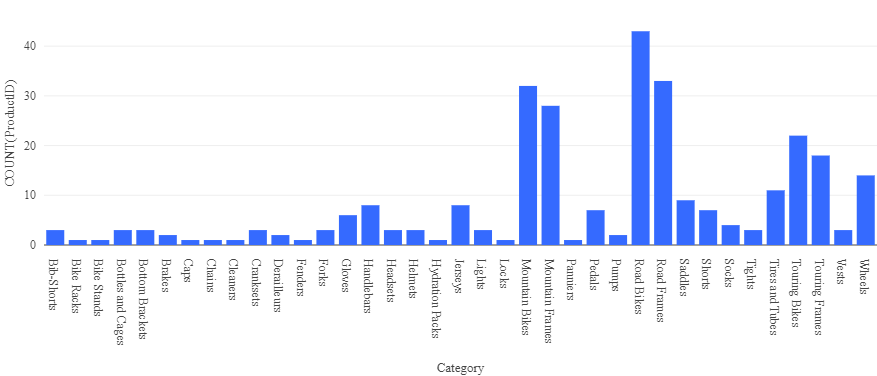

---
lab:
  title: Explorar o Azure Databricks
  ilt-use: Suggested demo
---

# Explorar o Azure Databricks

O Azure Databricks é uma versão baseada no Microsoft Azure da popular plataforma de código aberto Databricks.

Da mesma forma que o Azure Synapse Analytics, um *workspace* do Azure Databricks fornece um ponto central para gerenciar clusters, dados e recursos do Databricks no Azure.

Este exercício deve levar aproximadamente **30** minutos para ser concluído.

## Antes de começar

É necessário ter uma [assinatura do Azure](https://azure.microsoft.com/free) com acesso de nível administrativo.

## Provisione um workspace do Azure Databricks

Neste exercício, você usará um script para provisionar um novo workspace do Azure Databricks.

1. Em um navegador da Web, entre no [portal do Azure](https://portal.azure.com) em `https://portal.azure.com`.
2. Use o botão **[\>_]** à direita da barra de pesquisa na parte superior da página para criar um Cloud Shell no portal do Azure, selecionando um ambiente ***PowerShell*** e criando um armazenamento caso solicitado. O Cloud Shell fornece uma interface de linha de comando em um painel na parte inferior do portal do Azure, conforme mostrado aqui:

    

    > **Observação**: se você tiver criado anteriormente um cloud shell que usa um ambiente *Bash* , use o menu suspenso no canto superior esquerdo do painel do cloud shell para alterá-lo para ***PowerShell***.

3. Observe que você pode redimensionar o Cloud Shell arrastando a barra do separador na parte superior do painel ou usando os ícones **&#8212;** , **&#9723;** e **X** no canto superior direito do painel para minimizar, maximizar e fechar o painel. Para obter mais informações de como usar o Azure Cloud Shell, confira a [documentação do Azure Cloud Shell](https://docs.microsoft.com/azure/cloud-shell/overview).

4. No painel do PowerShell, insira os seguintes comandos para clonar esse repositório:

    ```
    rm -r dp-203 -f
    git clone https://github.com/MicrosoftLearning/dp-203-azure-data-engineer dp-203
    ```

5. Depois que o repositório tiver sido clonado, digite os seguintes comandos para alterar para a pasta deste laboratório e execute o script **setup.ps1** que ele contém:

    ```
    cd dp-203/Allfiles/labs/23
    ./setup.ps1
    ```

6. Se solicitado, escolha qual assinatura você deseja usar (isso só acontecerá se você tiver acesso a várias assinaturas do Azure).

7. Aguarde a conclusão do script – isso normalmente leva cerca de 5 minutos, mas em alguns casos pode levar mais tempo. Enquanto espera, revise o artigo [O que é o Azure Databricks?](https://learn.microsoft.com/azure/databricks/introduction/) na documentação do Azure Databricks.

## Criar um cluster

O Azure Databricks é uma plataforma de processamento distribuído que usa *clusters* do Apache Spark para processar dados em paralelo em vários nós. Cada cluster consiste em um nó de driver para coordenar o trabalho e nós de trabalho para executar tarefas de processamento.

> **Observação**: neste exercício, você criará um cluster de *nó único* para minimizar os recursos de computação usados no ambiente de laboratório (no qual os recursos podem ser restritos). Em um ambiente de produção, você normalmente criaria um cluster com vários nós de trabalho.

1. No portal do Azure, navegue até o grupo de recursos **dp203-*xxxxxxx*** que foi criado pelo script que você executou.
2. Selecione o recurso do Serviço Azure Databricks **databricks*xxxxxxx***.
3. Na página **Visão Geral** de **databricks*xxxxxxx***, use o botão **Iniciar Workspace** para abrir seu workspace do Azure Databricks em uma nova guia do navegador; entrando se solicitado.
4. Se uma mensagem **Qual é o seu projeto de dados atual?** for exibida, selecione **Concluir** para fechá-la. Em seguida, exiba o portal do workspace do Azure Databricks e observe que a barra lateral no lado esquerdo contém ícones para as várias tarefas que você pode executar.

    >**Dica**: Ao usar o portal do Workspace do Databricks, várias dicas e notificações podem ser exibidas. Dispense-os e siga as instruções fornecidas para concluir as tarefas neste exercício.

1. Selecione a tarefa **(+) Nova** e, em seguida, selecione **Cluster**.
1. Na página **Novo Cluster**, crie um novo cluster com as seguintes configurações:
    - **Nome do cluster**: cluster *Nome do Usuário* (o nome do cluster padrão)
    - **Modo do cluster**: Nó Único
    - **Modo de acesso**: usuário único (*com sua conta de usuário selecionada*)
    - **Versão de Tempo de Execução do Databricks**: 12.2 LTS (Scala 2.12, Spark 3.2.2)
    - **Usar Aceleração do Photon**: selecionado
    - **Tipo de nó**: Standard_DS3_v2
    - **Terminar após***30***minutos de inatividade**

7. Aguarde o cluster ser criado. Isso pode levar alguns minutos.

> **Observação**: se o cluster não for iniciado, sua assinatura pode ter cota insuficiente na região onde seu workspace do Azure Databricks está provisionado. Consulte [Limite de núcleo da CPU impede a criação do cluster](https://docs.microsoft.com/azure/databricks/kb/clusters/azure-core-limit) para obter os detalhes. Se isso acontecer, tente excluir seu workspace e criar um novo em uma região diferente. Você pode especificar uma região como um parâmetro para o script de instalação da seguinte maneira: `./setup.ps1 eastus`

## Usar o Spark para analisar um arquivo de dados

Como em muitos ambientes do Spark, o Databricks oferece suporte ao uso de notebooks para combinar anotações e células de código interativas que você pode usar para explorar dados.

1. Na barra lateral, use a tarefa **(+) Novo** para criar um **Notebook**.
1. Altere o nome padrão do notebook (**Notebook sem título *[data]***) para **Explorar produtos** e, na lista suspensa **Conectar**, selecione seu cluster (que pode levar cerca de um minuto para iniciar).
1. Baixe o arquivo [**products.csv**](https://raw.githubusercontent.com/MicrosoftLearning/dp-203-azure-data-engineer/master/Allfiles/labs/23/adventureworks/products.csv) para o computador local, salvando-o como **products.csv**. Em seguida, no notebook **Explorar produtos**, no menu **Arquivo**, selecione **Carregar dados para DBFS**.
1. Na caixa de diálogo **Carregar Dados**, observe o **Diretório de Destino DBFS** para onde o arquivo será carregado. Em seguida, selecione a área **Arquivos** e carregue o arquivo **products.csv** que você baixou para o seu computador. Quando o arquivo tiver sido carregado, selecione **Avançar**
1. No painel **Acessar arquivos de notebooks**, selecione o código PySpark de exemplo e copie-o para a área de transferência. Você o usará para carregar os dados do arquivo em um DataFrame. Em seguida, selecione **Concluído**.
1. No notebook **Explorar produtos**, na célula de código vazia, cole o código copiado, que deve ser semelhante a este:

    ```python
    df1 = spark.read.format("csv").option("header", "true").load("dbfs:/FileStore/shared_uploads/user@outlook.com/products.csv")
    ```

1. Use a opção do menu **▸ Executar Célula** no canto superior direito da célula para executá-la, iniciando e anexando o cluster, se solicitado.
1. Aguarde até que o trabalho do Spark executado pelo código seja concluído. O código criou um objeto de *dataframe* chamado **df1** a partir dos dados no arquivo carregado.
1. Na célula de código existente, use o ícone **+** para adicionar uma nova célula de código. Em seguida, na nova célula, insira o código a seguir:

    ```python
    display(df1)
    ```

1. Use a opção de menu **▸ Executar Célula** no canto superior direito da nova célula para executá-la. Esse código exibe o conteúdo do dataframe, que deve ser semelhante a este:

    | ProductID | ProductName | Categoria | ListPrice |
    | -- | -- | -- | -- |
    | 771 | Mountain-100 Silver, 38 | Mountain bikes | 3399.9900 |
    | 772 | Mountain-100 Silver, 42 | Mountain bikes | 3399.9900 |
    | ... | ... | ... | ... |

1. Acima da tabela de resultados, selecione **+** e, em seguida, selecione **Visualização** para exibir o editor de visualização e aplique as seguintes opções:
    - **Tipo de visualização**: Barra
    - **Coluna X**: Categoria
    - **Coluna Y**: *Adicione uma nova coluna e selecione***ProductID**. *Aplique a agregação***Contagem****.

    Salve a visualização e observe se ela é exibida no notebook, assim:

    

## Criar e consultar uma tabela

Embora muitas análises de dados se sintam confortáveis em usar linguagens como Python ou Scala para trabalhar com dados em arquivos, muitas soluções de análise de dados são construídas em bancos de dados relacionais; em que os dados são armazenados em tabelas e manipulados usando SQL.

1. No notebook **Explorar produtos**, na saída do gráfico da célula de código executada anteriormente, use o ícone **+** para adicionar uma nova célula.
2. Entre e insira o seguinte código na nova célula:

    ```python
    df1.write.saveAsTable("products")
    ```

3. Quando a célula tiver sido concluída, adicione uma nova célula sob ela com o seguinte código:

    ```sql
    %sql

    SELECT ProductName, ListPrice
    FROM products
    WHERE Category = 'Touring Bikes';
    ```

4. Execute a nova célula, que contém código SQL para retornar o nome e o preço dos produtos na categoria *Bicicletas de Turismo*.
5. Na guia à esquerda, selecione a tarefa **Catálogo** e verifique se a tabela de **produtos** foi criada no esquema de banco de dados padrão (que se chama **padrão**). É possível usar o código do Spark para criar esquemas de banco de dados personalizados e um esquema de tabelas relacionais que os analistas de dados podem usar para explorar dados e gerar relatórios analíticos.

## Excluir Recursos do Azure Databricks

Agora que terminou de explorar o Azure Databricks, você deve excluir os recursos criados para evitar custos desnecessários do Azure e liberar capacidade em sua assinatura.

1. Feche a guia do navegador do workspace do Azure Databricks e volte para o portal do Azure.
2. No portal do Azure, na **Página Inicial**, selecione **Grupos de recursos**.
3. Selecione o grupo de recursos **dp203-*xxxxxxx*** (não o grupo de recursos gerenciados) e verifique se ele contém workspace do Azure Databricks.
4. Na parte superior da página de **Visão Geral** do grupo de recursos, selecione **Excluir o grupo de recursos**.
5. Digite o nome do grupo de recursos **dp203-*xxxxxxx*** para confirmar que deseja excluí-lo e selecione **Excluir**.

    Após alguns minutos, seu grupo de recursos e os grupos de recursos do workspace gerenciado associado a ele serão excluídos.
