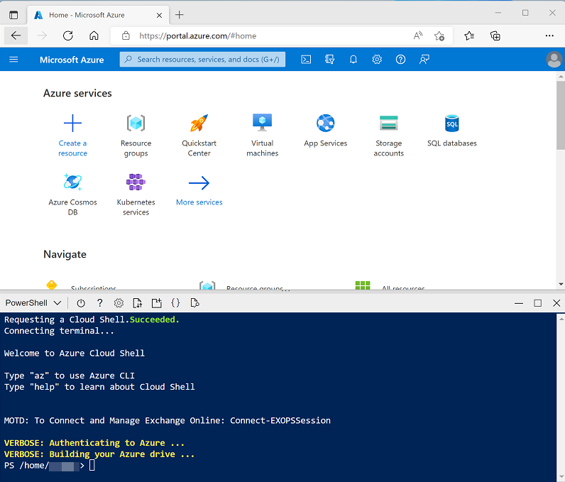

---
lab:
  title: Usar o Spark no Azure Databricks
  ilt-use: Lab
---

# Usar o Spark no Azure Databricks

O Azure Databricks é uma versão baseada no Microsoft Azure da popular plataforma de código aberto Databricks. O Azure Databricks foi criado no Apache Spark e oferece uma solução altamente escalonável para tarefas de engenharia e análise de dados que envolvem o trabalho com dados em arquivos. Um dos benefícios do Spark é o suporte a uma ampla variedade de linguagens de programação, incluindo Java, Scala, Python e SQL, tornando o Spark uma solução muito flexível para cargas de trabalho de processamento de dados, incluindo limpeza e processamento de dados, análise estatística e machine learning, análise e visualização de dados.

Este exercício deve levar aproximadamente **45** minutos para ser concluído.

## Antes de começar

É necessário ter uma [assinatura do Azure](https://azure.microsoft.com/free) com acesso de nível administrativo.

## Provisionar um workspace do Azure Databricks

Neste exercício, você usará um script para provisionar um novo workspace do Azure Databricks.

1. Em um navegador da Web, entre no [portal do Azure](https://portal.azure.com) em `https://portal.azure.com`.
2. Use o botão **[\>_]** à direita da barra de pesquisa na parte superior da página para criar um Cloud Shell no portal do Azure, selecionando um ambiente ***PowerShell*** e criando um armazenamento caso solicitado. O Cloud Shell fornece uma interface de linha de comando em um painel na parte inferior do portal do Azure, conforme mostrado aqui:

    

    > **Observação**: se você tiver criado anteriormente um cloud shell dque usa um ambiente *Bash* , use o menu suspenso no canto superior esquerdo do painel do cloud shell para alterá-lo para ***PowerShell***.

3. Observe que você pode redimensionar o Cloud Shell arrastando a barra do separador na parte superior do painel ou usando os ícones **&#8212;** , **&#9723;** e **X** no canto superior direito do painel para minimizar, maximizar e fechar o painel. Para obter mais informações de como usar o Azure Cloud Shell, confira a [documentação do Azure Cloud Shell](https://docs.microsoft.com/azure/cloud-shell/overview).

4. No painel do PowerShell, insira os seguintes comandos para clonar esse repositório:

    ```
    rm -r dp-203 -f
    git clone https://github.com/MicrosoftLearning/dp-203-azure-data-engineer dp-203
    ```

5. Depois que o repositório tiver sido clonado, digite os seguintes comandos para alterar para a pasta deste laboratório e execute o script **setup.ps1** que ele contém:

    ```
    cd dp-203/Allfiles/labs/24
    ./setup.ps1
    ```

6. Se solicitado, escolha qual assinatura você deseja usar (isso só acontecerá se você tiver acesso a várias assinaturas do Azure).

7. Aguarde a conclusão do script – isso normalmente leva cerca de 5 minutos, mas em alguns casos pode levar mais tempo. Enquanto espera, revise o artigo [Análise exploratória de dados no Azure Databricks na documentação do Azure Databricks](https://learn.microsoft.com/azure/databricks/exploratory-data-analysis/).

## Criar um cluster

O Azure Databricks é uma plataforma de processamento distribuído que usa *clusters* do Apache Spark para processar dados em paralelo em vários nós. Cada cluster consiste em um nó de driver para coordenar o trabalho e nós de trabalho para executar tarefas de processamento.

> **Observação**: neste exercício, você criará um cluster de *nó único* para minimizar os recursos de computação usados no ambiente de laboratório (no qual os recursos podem ser restritos). Em um ambiente de produção, você normalmente criaria um cluster com vários nós de trabalho.

1. No portal do Azure, navegue até o grupo de recursos **dp203-*xxxxxxx*** que foi criado pelo script que você executou.
2. Selecione o recurso **databricks*xxxxxxx*** do Serviço do Azure Databricks.
3. Na página **Visão geral** para **databricks*xxxxxxx***, use o botão **Iniciar Workspace** para abrir o seu workspace do Azure Databricks em uma nova guia do navegador, entrando se solicitado.
4. Se uma mensagem **Qual é o seu projeto de dados atual?** for exibida, selecione **Concluir** para fechá-la. Em seguida, exiba o portal do workspace do Azure Databricks e observe que a barra lateral no lado esquerdo contém ícones para as várias tarefas que você pode executar.

    >**Dica**: Ao usar o portal do Workspace do Databricks, várias dicas e notificações podem ser exibidas. Dispense-as e siga as instruções fornecidas para concluir as tarefas neste exercício.

1. Selecione a tarefa **(+) Nova** e, em seguida, selecione **Cluster**.
1. Na página **Novo Cluster**, crie um novo cluster com as seguintes configurações:
    - **Nome do cluster**: cluster do *Nome do Usuário* (o nome do cluster padrão)
    - **Modo do cluster**: Nó Único
    - **Modo de acesso**: usuário único (*com sua conta de usuário selecionada*)
    - **Versão do runtime do Databricks**: 12.2 LTS (Scala 2.12, Spark 3.2.2)
    - **Usar Aceleração do Photon**: selecionado
    - **Tipo de nó**: Standard_DS3_v2
    - **Terminar após***30***minutos de inatividade**

7. Aguarde a criação do cluster. Isso pode levar alguns minutos.

> **Observação**: se o cluster não for iniciado, sua assinatura pode ter cota insuficiente na região onde seu espaço de trabalho do Azure Databricks está provisionado. Consulte [Limite de núcleo da CPU impede a criação do cluster](https://docs.microsoft.com/azure/databricks/kb/clusters/azure-core-limit) para obter detalhes. Se isso acontecer, tente excluir seu workspace e criar um novo em uma região diferente. Você pode especificar uma região como um parâmetro para o script de instalação da seguinte maneira: `./setup.ps1 eastus`

## Explorar dados usando um notebook

Como em muitos ambientes do Spark, o Databricks oferece suporte ao uso de notebooks para combinar anotações e células de código interativas que você pode usar para explorar dados.

1. Na barra lateral à esquerda, selecione **Workspace**. Em seguida, selecione a pasta **⌂ Início**.
1. Na parte superior da página, no menu **⋮** ao lado do seu nome de usuário, selecione **Importar**. Em seguida, na caixa de diálogo **Importar** , selecione **URL** e importe o notebook de `https://github.com/MicrosoftLearning/dp-203-azure-data-engineer/raw/master/Allfiles/labs/24/Databricks-Spark.ipynb`
1. Conecte o bloco de anotações ao cluster e siga as instruções nele contidas; executando as células que ele contém para explorar dados em arquivos.

## Excluir recursos do Azure Databricks

Agora que terminou de explorar o Azure Databricks, você deve excluir os recursos criados para evitar custos desnecessários do Azure e liberar capacidade em sua assinatura.

1. Feche a guia do navegador do workspace do Azure Databricks e volte para o portal do Azure.
2. No portal do Azure, na **Página Inicial**, selecione **Grupos de recursos**.
3. Selecione o grupo de recursos **dp203-*xxxxxxx*** (não o grupo de recursos gerenciados) e verifique se ele contém seu espaço de trabalho do Azure Databricks.
4. Na parte superior da página de **Visão Geral** do grupo de recursos, selecione **Excluir o grupo de recursos**.
5. Digite o nome do grupo de recursos **dp203-*xxxxxxx*** para confirmar que deseja excluí-lo e selecione **Excluir**.

    Após alguns minutos, seu grupo de recursos e os grupos de recursos do workspace gerenciado associado a ele serão excluídos.
